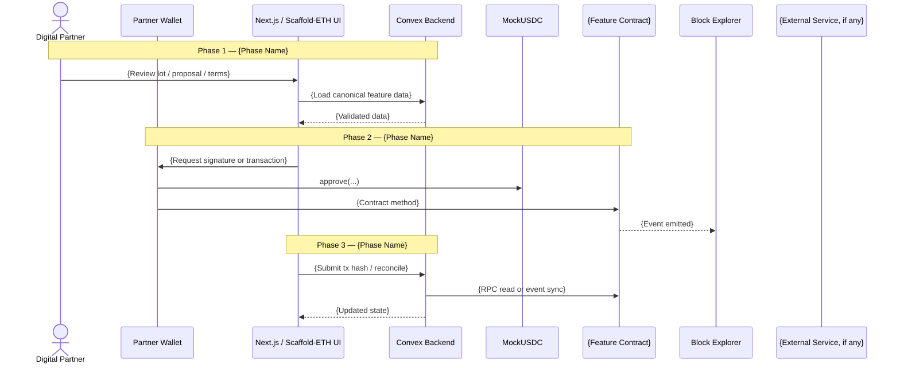
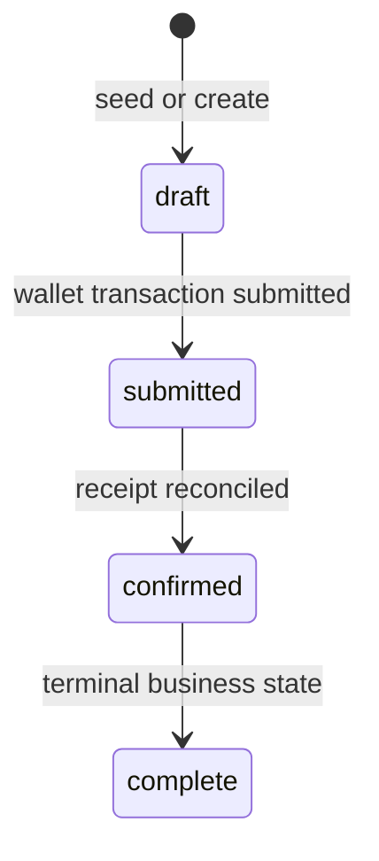
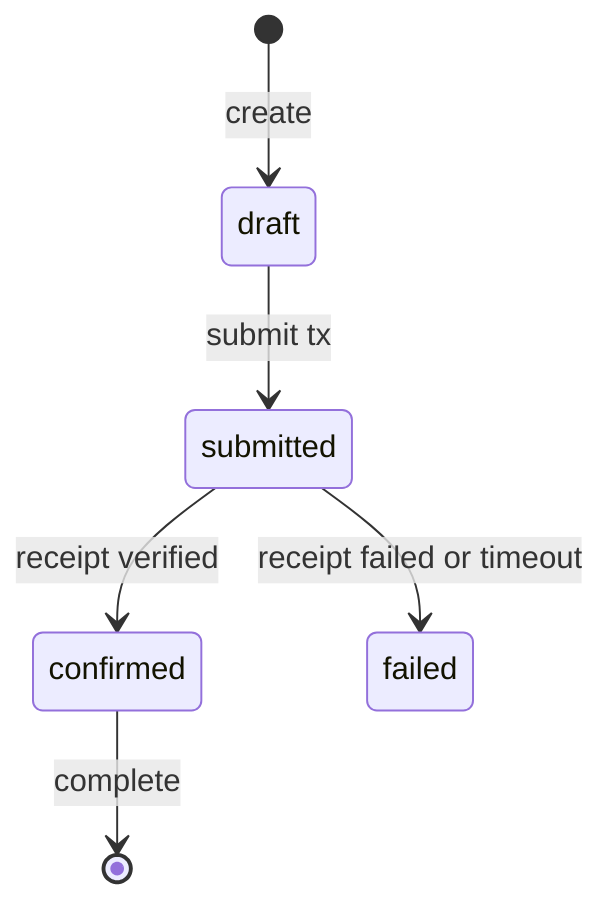

# Design Document Creation — Prompt & Template

**Purpose:** This document defines the prompt, structural template, and quality standards for creating a feature design document in this repository. The design document is the **first artifact** produced for any new feature — it serves as the single source of truth from which all phase plans, contract work, Convex work, and frontend implementation are derived.

---

## When to Use

Create a design document when:

- Starting a new feature or subsystem (e.g., partnership signing flow, coffee-lot evidence model, settlement distribution, contract event sync, admin demo controls)
- The work spans multiple phases, touches multiple packages/modules, and involves non-trivial decisions across Solidity, Convex, and the Next.js app
- You need a reference artifact that others (or future agents) can consume to understand scope, data model, contract model, wallet authority, security, and implementation order

Do **not** use this for:

- Single-file bug fixes or refactors
- Simple copy, styling, or content changes with no architectural impact
- Pure analysis documents — use the **Audit & Analysis** variant (see bottom of this document)

---

## Prompt

Use the following prompt (adapt the `{placeholders}` to your feature):

```
I need a comprehensive design specification for {FEATURE_NAME}.

**Scope:** {One-sentence description of what this feature covers end-to-end, including the starting state and the desired end state.}

**Prerequisite:** {What must already exist — completed phases, deployed contracts, Convex schema, installed dependencies, seeded demo data, etc. Say "None" if this is greenfield.}

**Context:**
- Read `AGENTS.md` and follow the repo-specific Scaffold-ETH 2, Hardhat, Convex, frontend, and skill instructions.
- This repo is currently the Scaffold-ETH 2 **Hardhat flavor** because `packages/hardhat` exists; use Foundry guidance only if the repository structure changes.
- Read `plans/first-product-design/fpd.md` for the Harvverse product, demo, legal-risk, actor, settlement, and architecture baseline.
- Read the existing codebase at {relevant directories/files} to understand the current implementation state.
- If Convex code is involved, read `convex/_generated/ai/guidelines.md` before designing Convex functions, schema, indexes, auth, or HTTP endpoints.
- If smart contracts are involved, inspect `packages/hardhat/contracts/`, `packages/hardhat/deploy/`, `packages/hardhat/test/`, and any installed OpenZeppelin contracts before proposing Solidity patterns.
- If frontend contract interactions are involved, inspect `packages/nextjs/hooks/scaffold-eth`, `packages/nextjs/contracts/deployedContracts.ts`, `packages/nextjs/contracts/externalContracts.ts`, and `packages/nextjs/scaffold.config.ts`.
- Use Context7 MCP for up-to-date library documentation where available (Wagmi, Viem, RainbowKit, DaisyUI, Hardhat, Next.js, etc.).
- Read {any relevant .docs/ entries, PRD sections, source documents, product plans, external API docs, sponsor docs, or blockchain docs} for domain knowledge.
- {Any important constraints: "testnet only", "no real funds", "no new packages", "must use existing wallet flow", "must use Scaffold-ETH hooks", "must work with existing Convex schema", etc.}

Produce a design specification document at `plans/{feature-name}/{feature-name}-design.md` following this exact structure:

1. **Header block** — Title as `{Feature Name} — Design Specification`. Include Version (0.1 MVP), Status (Draft), Scope (1-2 sentences covering start state to end state), Prerequisite (reference prior phases if any).

2. **Table of Contents** — Numbered, with anchor links to every section. The phase sections come first, then the cross-cutting sections (Data Model, Smart Contract Architecture, Convex Function Architecture, Routing & Authorization, Security, etc.).

3. **Goals & Non-Goals** — Clearly separate what this design covers (Goals as bullet points describing the end state) and what it explicitly defers (Non-Goals with target phase, version, or workstream annotation). For Harvverse, call out testnet/demo-only boundaries and any deferred legal, custody, KYC/AML, mainnet, or real-funds work.

4. **Actors & Roles** — Table of every actor who interacts with the system in this feature. Columns: Actor, Identity, Auth Method (e.g., "connected wallet + signed nonce", "allowlisted admin wallet", "Convex internal action"), Key Permissions. If application roles map to contract roles or Convex roles, include separate mapping tables.

5. **End-to-End Flow Overview** — A Mermaid `sequenceDiagram` showing the happy path across all actors and systems. Annotate each phase boundary with `Note over` blocks on the diagram. Every external system (wallet, EVM contract, explorer, oracle, AI provider, file/object storage, etc.) gets its own participant.

6. **Phase-by-phase narrative** — One numbered section per logical phase. Each section includes:
   - Subsections (e.g., 4.1, 4.2, 4.3) covering distinct aspects of the phase.
   - Prose explanation of what happens and why — written so someone with codebase access but no prior context can understand.
   - Realistic code examples showing actual Solidity contracts/deploy scripts, Convex functions, Scaffold-ETH hooks, SDK calls, and data flows. Every code block has a path comment: `// Path: convex/lots.ts`, `// Path: packages/hardhat/contracts/LotCertificate.sol`, or `// Path: packages/nextjs/app/lots/[lotId]/page.tsx`.
   - Mermaid diagrams where flows are complex — flowcharts for branching logic, sequence diagrams for multi-system interactions, state diagrams for status machines.
   - Tables for: field definitions, function arguments, contract methods, events, API parameters, status transitions, config values, environment variables, and package responsibilities.
   - Decision rationale in `>` blockquote blocks explaining non-obvious choices — especially: onchain vs. offchain boundaries, action vs. mutation, server-side vs. client-side, wallet signer vs. backend signer, security tradeoffs, and "why not X" justifications.

7. **Data Model** — Full Convex `defineTable` schema definitions for every new or modified table:
   - Every field with its Convex validator type (`v.string()`, `v.optional(v.id("lots"))`, etc.).
   - Every index with naming convention `by_<field1>_and_<field2>`.
   - Inline comments explaining non-obvious fields.
   - Status enums as `v.union(v.literal("a"), v.literal("b"), ...)`.
   - If a table is modified (not new), show only the added/changed fields with a comment: `// ... existing fields ...`.
   - Do not store unbounded child collections in array fields; design separate child tables with foreign keys.

8. **Smart Contract Architecture** — A file tree showing all new and modified files under `packages/hardhat/`, including contracts, deploy scripts, tests, and generated ABI expectations. Include contract responsibilities, public/external methods, events, access control, upgrade/deployment assumptions, and how deployment output reaches `packages/nextjs/contracts/deployedContracts.ts`.

9. **Convex Function Architecture** — A file tree showing the full relevant `convex/` directory structure, with annotations: `# NEW`, `# MODIFIED`, `# Description — Phase N`. Group by feature directory. Distinguish public `query`/`mutation`/`action` from private `internalQuery`/`internalMutation`/`internalAction`, and include argument validators for every function.

10. **Routing & Authorization** (if frontend is involved) — Next.js App Router file tree (`packages/nextjs/app/` directory), role-based routing logic with code examples, wallet/session gating strategy, and contract interaction strategy. Use `useScaffoldReadContract`, `useScaffoldWriteContract`, `useScaffoldEventHistory`, `useScaffoldWatchContractEvent`, `useDeployedContractInfo`, `useScaffoldContract`, and `useTransactor` as they exist in `packages/nextjs/hooks/scaffold-eth`.

11. **Security Considerations** — Subsections for:
    - Wallet and transaction authority (who signs each transaction; what Convex is allowed to prepare or verify but not sign).
    - Credential security (where tokens/keys are stored, what never reaches the client).
    - Role-based data access — a table with rows = data resources/actions, columns = roles, cells = access level (Full / Read / Own only / Sign only / None).
    - Contract access control (owner/admin/operator/verifier roles, pausing, replay/duplicate protections, reentrancy assumptions).
    - Webhook or HTTP endpoint security if applicable (signing keys, signature verification, replay protection).
    - Rate limit and RPC awareness (provider/API limits, Convex action limits, how the system stays within them).
    - Demo/legal boundaries for Harvverse (testnet only, no real funds, no production custody, no investment promises).

12. **Error Handling & Edge Cases** — One subsection per edge case. Each includes: scenario description, detection mechanism, recovery action (retry? alert? degrade gracefully? fallback mode?), and user-facing behavior (toast? disabled button? banner? transaction retry?).

13. **Open Questions** — Table with columns: #, Question, Current Thinking. Capture every unresolved decision with your best-guess recommendation. Mark resolved questions with strikethrough.

14. **Dependencies** — Three tables:
    - New packages: Package, Why, Runtime, Install command.
    - Already-installed packages (no action needed): Package, Used for.
    - Environment variables: Variable, Where set (Convex env / `.env.local` / deployment environment), Used by.
    - Any external service configuration (e.g., "Configure RPC provider", "Create Chainlink subscription", "Register oracle/API key", "Set Convex env var").

15. **Applicable Skills** — Table of repository skills to invoke during implementation. Columns: Skill, When to invoke, Phase(s). Use only skills that exist in `.agents/skills/` or the active Codex skills list.

**Formatting rules:**
- GitHub-flavored Markdown.
- Code blocks with language tags (`typescript`, `tsx`, `solidity`, `bash`, `css`, `mermaid`).
- Every code example includes a path comment: `// Path: convex/...`, `// Path: packages/hardhat/...`, or `// Path: packages/nextjs/...`.
- Decision rationale uses `>` blockquotes.
- Tables use aligned pipes.
- The document is self-contained — a reader with codebase access but no prior conversation context can understand and implement from this document alone.
```

---

## Template Structure

````markdown
# {Feature Name} — Design Specification

**Version:** 0.1 (MVP)
**Status:** Draft
**Scope:** {Start state} → {End state}. {One-liner covering the full scope.}
**Prerequisite:** {Prior phases, deployed contracts, deployed schema, installed deps, seeded data, or "None".}

---

## Table of Contents

1. [Goals & Non-Goals](#1-goals--non-goals)
2. [Actors & Roles](#2-actors--roles)
3. [End-to-End Flow Overview](#3-end-to-end-flow-overview)
4. [Phase 1: {Name}](#4-phase-1-name)
5. [Phase 2: {Name}](#5-phase-2-name)
...
N.   [Data Model](#n-data-model)
N+1. [Smart Contract Architecture](#n1-smart-contract-architecture)
N+2. [Convex Function Architecture](#n2-convex-function-architecture)
N+3. [Routing & Authorization](#n3-routing--authorization)
N+4. [Security Considerations](#n4-security-considerations)
N+5. [Error Handling & Edge Cases](#n5-error-handling--edge-cases)
N+6. [Open Questions](#n6-open-questions)
N+7. [Dependencies](#n7-dependencies)
N+8. [Applicable Skills](#n8-applicable-skills)

---

## 1. Goals & Non-Goals

### Goals

- {Goal 1 — describes the system's behavior after this feature ships.}
- {Goal 2 — be specific: "A Digital Partner signs acceptance and deposit transactions from their own connected wallet."}
- {Goal 3 — be specific: "Convex stores evidence and reconciles onchain events without signing user/admin financial intent."}

### Non-Goals (deferred)

- {Non-goal 1 (Phase 2 / post-hackathon / legal workstream).}
- {Non-goal 2 (separate design doc).}

---

## 2. Actors & Roles

| Actor | Identity | Auth Method | Key Permissions |
| --- | --- | --- | --- |
| **Digital Partner** | {Who they are} | Connected wallet + signed nonce | {What they can do in this feature} |
| **Harvverse Admin** | {Who they are} | Allowlisted admin wallet + Convex role | {What they can do} |
| **Convex System** | Backend functions and scheduled jobs | Internal Convex functions / env secrets | {What it can do, and what it must not sign} |
| **Contract** | {Solidity contract name} | EVM execution + role checks | {What state it owns/enforces} |

### Application Role <-> Contract Role Mapping (if applicable)

| App Role | Contract Role / Capability | Notes |
| --- | --- | --- |
| `partner` | Own wallet signer | Signs own proposal/deposit/approval transactions only. |
| `admin` | `DEFAULT_ADMIN_ROLE` or owner | Configure demo data and admin-only contract operations. |
| `settlement_operator` | `SETTLEMENT_OPERATOR_ROLE` | Executes settlement after required funding and checks. |
| `verifier` | `VERIFIER_ROLE` | Attests plan/evidence claims. |

### Application Role <-> Convex Access Mapping (if applicable)

| App Role | Convex Access | Notes |
| --- | --- | --- |
| `public` | Read published demo data only | No private proposal, wallet, or evidence internals. |
| `partner` | Own proposal/session rows | Scope by verified wallet/session, not arbitrary client input. |
| `admin` | Admin tables and operations | Require allowlist/role checks in every public function. |
| `system` | Internal functions only | Use `internalQuery`, `internalMutation`, and `internalAction` for sensitive paths. |

---

## 3. End-to-End Flow Overview



---

## 4. Phase 1: {Phase Name}

### 4.1 {What & Why}

{Prose explanation of this phase's purpose and approach. Explain what belongs onchain, what belongs in Convex, and what belongs only in the browser.}

> **Boundary decision:** {Rationale for choosing onchain state vs. Convex state, wallet signer vs. backend preparation, action vs. mutation, server-side vs. client-side, etc. Explain the alternatives considered and why this approach wins.}
>
> **Dependency:** {Any package, contract deployment, Convex env var, RPC provider, or seeded fixture that must be available.}

### 4.2 {Contract Detail, if applicable}

```solidity
// Path: packages/hardhat/contracts/{ContractName}.sol
// SPDX-License-Identifier: MIT
pragma solidity ^0.8.20;

contract {ContractName} {
    event {EventName}(uint256 indexed lotId, address indexed actor);

    function {methodName}(uint256 lotId) external {
        // Implementation with realistic detail
    }
}
```

**Contract methods and events:**

| Operation | Method / Event | Signer | Notes |
| --- | --- | --- | --- |
| {Operation name} | `{methodName}({args})` | {Wallet/role} | {What is enforced onchain} |
| {Event name} | `event {EventName}(...)` | Contract | {How Convex/UI consumes it} |

### 4.3 {Convex Detail, if applicable}

```typescript
// Path: convex/{feature}/{file}.ts
import { v } from "convex/values";
import { mutation, query } from "../_generated/server";

export const getLotProposal = query({
  args: { lotId: v.id("lots") },
  handler: async (ctx, { lotId }) => {
    return await ctx.db.get(lotId);
  },
});

export const recordTransactionHash = mutation({
  args: {
    proposalId: v.id("proposals"),
    txHash: v.string(),
  },
  handler: async (ctx, { proposalId, txHash }) => {
    await ctx.db.patch(proposalId, { txHash, status: "submitted" });
  },
});
```

**Convex functions:**

| Function | Type | Public/Internal | Args | Notes |
| --- | --- | --- | --- | --- |
| `{functionName}` | `query` / `mutation` / `action` | Public / Internal | `{args}` | {Role check and behavior} |

### 4.4 {Frontend Detail, if applicable}

```tsx
// Path: packages/nextjs/app/{route}/page.tsx
"use client";

import { useScaffoldReadContract, useScaffoldWriteContract } from "~~/hooks/scaffold-eth";

export default function {FeaturePage}() {
  const { data: lotState } = useScaffoldReadContract({
    contractName: "{ContractName}",
    functionName: "{readMethod}",
    args: [1n],
  });

  const { writeContractAsync, isPending } = useScaffoldWriteContract({
    contractName: "{ContractName}",
  });

  return (
    <button
      className="btn btn-primary"
      disabled={isPending}
      onClick={() => writeContractAsync({ functionName: "{writeMethod}", args: [1n] })}
    >
      {isPending ? "Confirming" : "Sign"}
    </button>
  );
}
```

**UI and routing notes:**

| UI Surface | Route | Data Source | Interaction |
| --- | --- | --- | --- |
| {Page or component} | `packages/nextjs/app/{route}` | Convex / contract hook | {What the user does} |

### 4.5 {Data or Status Transitions}



Triggered when: {description of what causes each transition.}

### 4.6 {Storage / Security Detail}

| Field / Secret / Authority | Storage / Owner | Notes |
| --- | --- | --- |
| `txHash` | Convex document field | Public chain reference; validate format and reconcile receipt. |
| `PRIVATE_API_KEY` | Convex environment variable | Never sent to the client. |
| Partner private key | User wallet only | Never stored or proxied by Convex. |
| Admin/operator authority | Admin/operator wallet | Contract role checks enforce privileged methods. |

---

## {Continue phases 5, 6, 7... following the same subsection pattern}

---

## {N}. Data Model

### {N}.1 `{tableName}` Table

```typescript
// Path: convex/schema.ts
{tableName}: defineTable({
  lotId: v.id("lots"),
  walletAddress: v.string(),
  txHash: v.optional(v.string()),
  status: v.union(
    v.literal("draft"),
    v.literal("submitted"),
    v.literal("confirmed"),
    v.literal("failed"),
  ),
  referenceId: v.optional(v.id("otherTable")),
  createdAt: v.number(), // Unix ms
})
  .index("by_lotId", ["lotId"])
  .index("by_walletAddress_and_status", ["walletAddress", "status"]),
```

### {N}.2 Modified: `{existingTable}` Table

```typescript
// Path: convex/schema.ts
{existingTable}: defineTable({
  // ... existing fields ...

  // NEW: {Description}
  newField: v.optional(v.id("users")),
})
  // ... existing indexes ...
```

### {N}.X Status State Machine (if applicable)



---

## {N+1}. Smart Contract Architecture

```
packages/hardhat/
├── contracts/
│   ├── {ContractName}.sol           # NEW: {Contract responsibility} — Phase {N}
│   └── {ExistingContract}.sol       # MODIFIED: {what changed} — Phase {N}
├── deploy/
│   └── 01_deploy_{contract}.ts      # NEW: deploy and post-deploy configuration — Phase {N}
└── test/
    └── {ContractName}.ts            # NEW: role, event, settlement, and edge-case tests — Phase {N}
```

### Contract Responsibilities

| Contract | Owns | Does Not Own | Key Events |
| --- | --- | --- | --- |
| `{ContractName}` | {Onchain state and enforcement} | {Offchain metadata / UI-only state} | `{EventName}` |

### Deployment Notes

```typescript
// Path: packages/hardhat/deploy/01_deploy_{contract}.ts
import { HardhatRuntimeEnvironment } from "hardhat/types";
import { DeployFunction } from "hardhat-deploy/types";

const deployContract: DeployFunction = async function (hre: HardhatRuntimeEnvironment) {
  const { deployer } = await hre.getNamedAccounts();
  const { deploy } = hre.deployments;

  await deploy("{ContractName}", {
    from: deployer,
    args: [],
    log: true,
    autoMine: true,
  });
};

deployContract.tags = ["{ContractName}"];
export default deployContract;
```

> **Deploy script gas note:** Manual post-deploy calls such as `transferOwnership`, `grantRole`, or `initialize` must set gas at the call site when needed, preferably with `estimateGas` plus margin. Do not fix call-site gas failures by changing the global Hardhat `blockGasLimit`.

---

## {N+2}. Convex Function Architecture

```
convex/
├── {feature}/                       # NEW: {Feature description}
│   ├── queries.ts                   # Public reads with validators — Phase {N}
│   ├── mutations.ts                 # Public writes with role checks — Phase {N}
│   ├── actions.ts                   # Server-side external calls / RPC sync — Phase {N}
│   └── internal.ts                  # Internal helpers and private functions — Phase {N}
├── lib/
│   └── {utility}.ts                 # NEW: {Description} — Phase {N}
├── schema.ts                        # MODIFIED: new/changed tables — Phase 1
├── crons.ts                         # MODIFIED: scheduled event sync, if needed — Phase {N}
└── http.ts                          # MODIFIED: HTTP endpoints/webhooks, if needed — Phase {N}
```

### Function Registration Rules

| Use Case | Register As | Notes |
| --- | --- | --- |
| Client-visible reads | `query` | Include validators and role/scope checks. |
| Client-visible writes | `mutation` | Keep transactional; validate args and actor authority. |
| External API/RPC/LLM calls | `action` | Use `"use node"` only when the package/runtime requires Node. |
| Sensitive backend-only reads | `internalQuery` | Do not expose through public API. |
| Sensitive backend-only writes | `internalMutation` | Call through `ctx.runMutation(internal...)`. |
| Sensitive backend-only external calls | `internalAction` | Use for private orchestration. |

---

## {N+3}. Routing & Authorization

### Route Structure

```
packages/nextjs/app/
├── layout.tsx                       # App providers and shared shell
├── page.tsx                         # Public demo entry or role-aware redirect
├── lots/
│   ├── page.tsx                     # Published lot catalog
│   └── [lotId]/
│       └── page.tsx                 # Lot detail, proposal, wallet actions
├── partner/
│   └── page.tsx                     # Connected wallet partner dashboard
└── admin/
    ├── page.tsx                     # Admin dashboard, allowlisted wallet only
    └── settlement/
        └── page.tsx                 # Settlement operator flow
```

### Role-Based Routing Logic

```tsx
// Path: packages/nextjs/app/admin/page.tsx
"use client";

import { Address } from "@scaffold-ui/components";
import { notification } from "~~/utils/scaffold-eth";

const isAdmin = Boolean(address && adminWallets.includes(address.toLowerCase()));

if (!isAdmin) {
  notification.error("Admin wallet required");
  return null;
}

return <Address address={address} />;
```

### Contract Interaction Rules

| Need | Preferred Hook / Utility | Notes |
| --- | --- | --- |
| Read contract state | `useScaffoldReadContract` | Do not use old `useScaffoldContractRead`. |
| Write contract state | `useScaffoldWriteContract` + `useTransactor` when useful | Do not use old `useScaffoldContractWrite`. |
| Watch events | `useScaffoldWatchContractEvent` | For live UI reaction. |
| Load historical events | `useScaffoldEventHistory` | Use bounded `fromBlock`. |
| Contract metadata | `useDeployedContractInfo` / `useScaffoldContract` | Pull from generated deployments. |

---

## {N+4}. Security Considerations

### {N+4}.1 Wallet and Transaction Authority
- Partner transactions are signed only by the partner's connected wallet.
- Admin/operator transactions are signed only by the allowlisted admin/operator wallet.
- Convex prepares intent, stores signatures/hashes, reads RPC state, and reconciles receipts; it does not hold private keys for financial actions.

### {N+4}.2 Credential Security
- `{SECRET}` is a Convex environment variable, never sent to the browser.
- All external API token operations happen in Convex actions or internal actions.
- Client-exposed values use `NEXT_PUBLIC_` only when disclosure is intended.

### {N+4}.3 Role-Based Data Access

| Data / Action | Public | Partner | Verifier | Admin | Settlement Operator | System |
| --- | --- | --- | --- | --- | --- | --- |
| Published lot summary | Read | Read | Read | Full | Read | Read |
| Own proposal | None | Own only | None | Full | Read | Read/Write |
| Evidence records | Read approved | Read approved | Create/Read | Full | Read | Read/Write |
| Settlement execution | None | None | None | Coordinate | Sign/Execute | Reconcile only |
| Fallback mode | Read status | Read status | Read status | Full | Read | Read |

### {N+4}.4 Contract Access Control
- Define the owner/admin/operator/verifier roles and who receives them at deployment.
- Document pause/emergency controls if present.
- Document replay protection, duplicate processing guards, and one-time settlement/mint constraints.
- Document reentrancy assumptions for token transfers and external callbacks.

### {N+4}.5 Webhook or HTTP Endpoint Security
- Verify signatures or shared secrets for inbound webhooks.
- Use timestamp tolerance and idempotency keys for replay protection.
- Persist raw event references only when needed for audit/debug.

### {N+4}.6 Rate Limit and RPC Awareness

| Limit | Value | Our usage |
| --- | --- | --- |
| RPC reads | {Provider-specific} | Batch or cache through Convex where possible. |
| External API calls | {N}/min | Use actions, retries with backoff, and fallback mode. |
| Convex function limits | {Relevant limit} | Keep high-churn or large data out of single documents. |

### {N+4}.7 Demo and Legal Boundaries
- This repo's Harvverse MVP is a testnet technical prototype.
- Do not design real fund custody, retail investment onboarding, KYC/AML, mainnet settlement, or profit promises without a separate legal/product workstream.
- UI copy and docs must distinguish demo MockUSDC/testnet flows from production custody.

---

## {N+5}. Error Handling & Edge Cases

### {N+5}.1 {Scenario Name}

{What goes wrong. How we detect it. What we do about it. What the user sees.}

| Error | Cause | Detection | Action |
| --- | --- | --- | --- |
| `{status}` | {Why it happens} | {Receipt/API/Convex/contract check} | {Recovery strategy} |

### Required Edge Case Coverage

| Category | Examples |
| --- | --- |
| Wallet/auth failures | Wallet disconnected, wrong network, wrong signer, rejected signature, stale nonce. |
| Transaction failures | Revert, insufficient allowance/balance, dropped tx, replaced tx, duplicate submission. |
| Convex/API failures | Action timeout, external API unavailable, schema validation failure, duplicate event processing. |
| Contract sync failures | Event not indexed yet, RPC provider lag, chain reorg on testnet, generated ABI missing. |
| Demo fallback | AI unavailable, oracle unavailable, metadata not visible in wallet, explorer slow. |
| Partial completion | Approval succeeded but deposit failed, tx submitted but UI closed, settlement funded but not executed. |

---

## {N+6}. Open Questions

| # | Question | Current Thinking |
| --- | --- | --- |
| 1 | {Unresolved question} | {Best-guess answer or "Deferred to Phase N"} |
| ~~2~~ | ~~{Resolved question}~~ | **Resolved.** {Answer.} |

---

## {N+7}. Dependencies

### New Packages

| Package | Why | Runtime | Install |
| --- | --- | --- | --- |
| `{package}` | {Reason} | Next.js / Convex action / Hardhat | `pnpm add {package}`, `pnpm --filter @se-2/nextjs add {package}`, or `pnpm --filter @se-2/hardhat add {package}` |

### Already Installed (no action needed)

| Package | Used for |
| --- | --- |
| `convex` | Backend database, functions, scheduled jobs, and optional HTTP endpoints. |
| `@rainbow-me/rainbowkit` | Wallet connection UI. |
| `wagmi` | React wallet and contract interaction primitives under Scaffold-ETH hooks. |
| `viem` | Typed EVM calls, address/hash utilities, and ABI typing. |
| `@scaffold-ui/components` | Web3 UI components such as `Address`, `AddressInput`, `Balance`, `EtherInput`, `IntegerInput`. |
| `@scaffold-ui/hooks` | Scaffold-ETH hook support. |
| `daisyui` | Component styling primitives. |
| `hardhat` / `hardhat-deploy` | Contract compile, deploy, test, and generated ABI workflow. |

### Environment Variables

| Variable | Where Set | Used By |
| --- | --- | --- |
| `{VAR}` | Convex env (`npx convex env set`) | {Module or function} |
| `{NEXT_PUBLIC_VAR}` | `.env.local` / Vercel | {Client component} |
| `{RPC_URL}` | Hardhat config env / deployment env | Contract deployment and verification. |

### External Service Configuration

| Service | Configuration | Used By |
| --- | --- | --- |
| RPC provider | Testnet endpoint and API key | Hardhat deploy, Convex sync, frontend reads. |
| Block explorer | API key, if verification is required | `pnpm verify --network <network>`. |
| Chainlink / oracle | Subscription, router, DON, secrets, if used | Optional oracle phase. |
| AI provider | Server-side API key, if used | Convex action that explains precomputed data. |

---

## {N+8}. Applicable Skills

| Skill | When to Invoke | Phase |
| --- | --- | --- |
| `convex` / `convex-quickstart` | Convex routing guidance or initial backend setup. | Backend phases |
| `convex-setup-auth` | Wallet/session identity mapping, user table, and access control design. | Auth phases |
| `convex-migration-helper` | Existing Convex data needs schema-safe widening/backfill/narrowing. | Migration phases |
| `convex-performance-audit` | High-read subscriptions, event sync, or hot dashboard paths need optimization. | Performance phases |
| `openzeppelin` | Contracts use OpenZeppelin access control, token standards, or security primitives. | Contract phases |
| `erc-721` | Certificate/NFT behavior, metadata, minting, non-transferability, or marketplace fields. | Certificate phases |
| `eip-5792` | Batched wallet transactions or `wallet_sendCalls` are part of the UX. | Wallet UX phases |
| `siwe` | Sign-In with Ethereum sessions or wallet-authenticated backend access. | Auth phases |
| `ponder` / `subgraph` | Event indexing grows beyond simple Convex/RPC sync. | Indexing phases |
| `x402` | Payment-gated HTTP routes or API monetization. | Payment/API phases |
| `drizzle-neon` | A separate PostgreSQL persistence layer is explicitly required. | Offchain data phases |
| `playwright` | Browser verification of UI flows, screenshots, or local app testing. | Frontend QA phases |

---

*This document is a living specification. Sections will be updated as implementation progresses and open questions are resolved.*
````

---

## Design Document Variants

### Backend-Heavy Features (e.g., settlement sync, evidence processing, oracle integration)

Emphasize:
- Mermaid **sequence diagrams** for multi-system interactions across wallets, Convex, contracts, RPC providers, and external services
- **Contract method/event tables** for Solidity interfaces and emitted events
- **SDK/API method tables** for Chainlink, AI providers, RPC providers, storage, or external APIs
- **Transaction lifecycle** details (prepare intent, wallet signature, tx hash, receipt reconciliation, retries, duplicate guards)
- **Webhook/HTTP flows** (signature verification, replay protection, raw event persistence)
- **Cron job** definitions for event sync or stale-state recovery
- Data Model section is critical — include every field, index, validator, and idempotency key

### Full-Stack Features (e.g., partner signing flow, admin settlement panel, lot dashboard)

Include both:
- Smart Contract Architecture, Convex Function Architecture, AND Routing & Authorization
- Phase narrative covers contract/deploy/test work, Convex reads/writes/sync, then frontend pages/components that consume them
- Mermaid **flowcharts** for UI flows (wallet connection, form submission, modal interactions, transaction confirmation, navigation)
- **Navigation structure** tables (Route | Tab | Content | Role)
- **Dashboard layout** diagrams showing component hierarchy
- Scaffold-ETH hook examples using the exact hook names available in `packages/nextjs/hooks/scaffold-eth`
- DaisyUI and `@scaffold-ui/components` usage for production UI examples

### Frontend-Only / Audit Features (e.g., homepage revamp, contract UX audit, caching analysis)

Replace the standard structure with the **Audit & Analysis** format:

```markdown
# {Feature} Audit & Analysis

**Date:** {Date}
**Scope:** {What was audited}
**Approach:** {Methodology}
**Skills applied:** {List of skills used}

## Table of Contents
1. Executive Summary
2-N. {Issue-by-issue analysis sections}
N+1. Prioritised Improvement Plan

## 1. Executive Summary

| Severity | Count | Summary |
|----------|-------|---------|
| Critical | N | {One-liner} |
| High     | N | {One-liner} |
| Medium   | N | {One-liner} |

## 2. {Issue Category}

### {Specific Issue}
**Files:** `{path}` (line {N})
**Problem:** {What's wrong, with code excerpt.}
**Recommendation:** {What to do, with code example.}

## {N+1}. Prioritised Improvement Plan

### Phase 1: {Theme} (Days N-M)
| # | Task | Impact | Effort |
|---|------|--------|--------|
| 1 | **{Task name}**: {description} | {What it fixes} | Low/Medium/High |

## Appendix A: Files Referenced
| File | Section(s) |
|------|-----------|
| `{path}` | {N, M} |

## Appendix B: Skills & Guidelines Applied
| Skill | Key Findings |
|-------|-------------|
| `{skill}` | {Summary} |
```

---

## Quality Checklist

Before considering the design document complete, verify:

- [ ] The design follows `AGENTS.md` and, for Convex work, `convex/_generated/ai/guidelines.md`
- [ ] Current library behavior is checked through Context7 MCP or primary docs where the feature depends on version-specific APIs
- [ ] Every phase has realistic code examples (not pseudo-code) for the layers it touches
- [ ] Every code example has a `// Path:` comment
- [ ] Every new or modified Convex table has full schema validators and indexes
- [ ] Convex functions use validators, correct public/internal registration, and clear auth/scope checks
- [ ] Smart contract changes include contracts, deploy scripts, tests, events, access control, and deployment/ABI generation notes
- [ ] Frontend contract examples use current hooks from `packages/nextjs/hooks/scaffold-eth`, not deprecated hook names
- [ ] Frontend examples use Next.js App Router paths under `packages/nextjs/app/`
- [ ] Web3 UI examples use `@scaffold-ui/components` where applicable and DaisyUI classes for components
- [ ] A Mermaid sequence diagram covers the complete happy path with phase annotations
- [ ] Goals and Non-Goals are clearly separated with phase/version/workstream annotations on non-goals
- [ ] Actors table includes auth method, permissions, and signer/authority boundaries
- [ ] Decision rationale blocks explain non-obvious choices (onchain/offchain, runtime, security, architecture)
- [ ] Open Questions table captures every unresolved decision
- [ ] Security section covers: wallet authority, credentials, role-based access, contract access control, webhooks/HTTP endpoints if applicable, and rate/RPC limits
- [ ] Harvverse demo/legal boundaries are explicit: testnet only, no real funds, no production custody, no investment promises unless separately approved
- [ ] Error handling covers at minimum: wallet/auth failures, API errors, timeout/retry, duplicate processing, partial failures, transaction failures, and contract sync lag
- [ ] Dependencies section has tables for new packages, already-installed packages, environment variables, and external service configuration
- [ ] Applicable Skills table maps repo skills to phases
- [ ] A reader with codebase access but no conversation context can implement from this document alone
- [ ] The document file lives at `plans/{feature-name}/{feature-name}-design.md`
