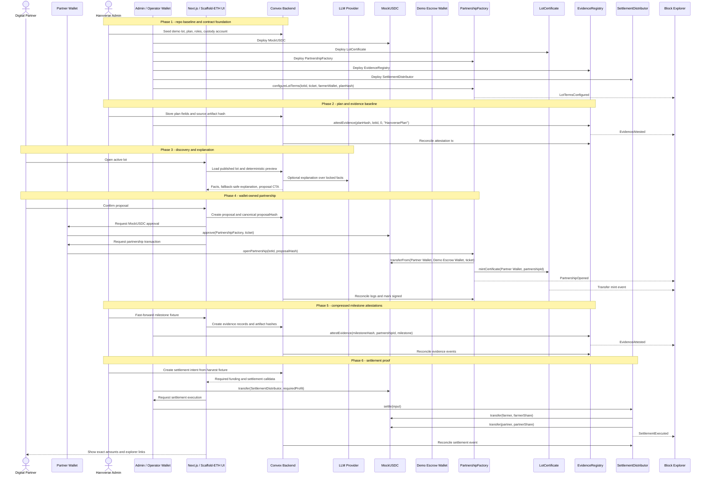
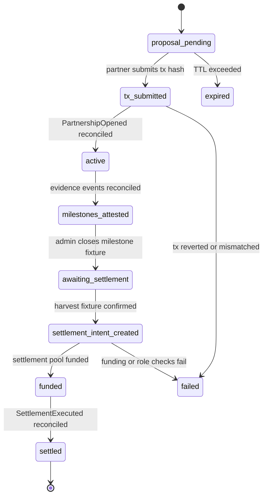

# Harvverse First Product — Design Specification

**Version:** 0.1 (MVP)
**Status:** Draft
**Scope:** Current Scaffold-ETH 2 Hardhat + Convex scaffold -> a testnet-only Harvverse demo where a Digital Partner reviews a coffee lot, signs a wallet-owned partnership transaction, receives a non-transferable certificate, and sees evidence-backed deterministic settlement.
**Prerequisite:** Repository baseline only: `packages/hardhat`, `packages/nextjs`, root `convex/`, `pnpm` workspace, and the existing source materials referenced by the first product plan. No Harvverse contracts, Convex schema, or frontend routes are assumed to already exist.

---

## Table of Contents

1. [Goals & Non-Goals](#1-goals--non-goals)
2. [Actors & Roles](#2-actors--roles)
3. [End-to-End Flow Overview](#3-end-to-end-flow-overview)
4. [Phase 1: Repository Baseline and Contract Foundation](#4-phase-1-repository-baseline-and-contract-foundation)
5. [Phase 2: Plan Data and Evidence Baseline](#5-phase-2-plan-data-and-evidence-baseline)
6. [Phase 3: Discovery, Proposal, and AI Explanation](#6-phase-3-discovery-proposal-and-ai-explanation)
7. [Phase 4: Partner Signing and Certificate Mint](#7-phase-4-partner-signing-and-certificate-mint)
8. [Phase 5: Milestone Attestations](#8-phase-5-milestone-attestations)
9. [Phase 6: Settlement and Demo Proof](#9-phase-6-settlement-and-demo-proof)
10. [Data Model](#10-data-model)
11. [Smart Contract Architecture](#11-smart-contract-architecture)
12. [Convex Function Architecture](#12-convex-function-architecture)
13. [Routing & Authorization](#13-routing--authorization)
14. [Security Considerations](#14-security-considerations)
15. [Error Handling & Edge Cases](#15-error-handling--edge-cases)
16. [Open Questions](#16-open-questions)
17. [Dependencies](#17-dependencies)
18. [Applicable Skills](#18-applicable-skills)

---

## 1. Goals & Non-Goals

### 1.1 Repository Alignment

This document is aligned to the repository as it exists now:

| Area            | Current Repository Fact                                                                                                                                                                                                               | Design Implication                                                                                                                          |
| --------------- | ------------------------------------------------------------------------------------------------------------------------------------------------------------------------------------------------------------------------------------- | ------------------------------------------------------------------------------------------------------------------------------------------- |
| Solidity flavor | `packages/hardhat` exists; no `packages/foundry` package exists                                                                                                                                                                       | Use Hardhat deploy scripts, tests, and `pnpm contracts:deploy`; do not write Foundry scripts for MVP.                                       |
| Package manager | `pnpm@10.17.1` with `pnpm-workspace.yaml`                                                                                                                                                                                             | All install commands use `pnpm`, not `yarn`.                                                                                                |
| Frontend        | Next.js App Router, React 19, RainbowKit, wagmi, viem, DaisyUI 5, `@scaffold-ui/components`                                                                                                                                           | Use App Router routes, Scaffold-ETH hooks, DaisyUI classes, and `@scaffold-ui/components` for web3 UI.                                      |
| Contracts       | `@openzeppelin/contracts` is already installed in `packages/hardhat` at `~5.0.2`                                                                                                                                                      | Do not add OpenZeppelin again. Use OpenZeppelin v5 named imports and verify override points from installed source.                          |
| Chain config    | `packages/hardhat/hardhat.config.ts` already includes `celoSepolia`, `baseSepolia`, `polygonAmoy`, and common EVM networks; `packages/nextjs/scaffold.config.ts` currently targets `hardhat` only                                     | Keep local development on `hardhat`; add the selected demo testnet to `scaffold.config.ts` only when ready to deploy.                       |
| Convex          | Root `convex/` exists with generated files and `convex/_generated/ai/guidelines.md`; no application schema/functions yet                                                                                                              | Define `convex/schema.ts` and functions from scratch, using validators and `internal*` functions for private paths.                         |
| Contract hooks  | `packages/nextjs/hooks/scaffold-eth` exports `useScaffoldReadContract`, `useScaffoldWriteContract`, `useScaffoldEventHistory`, `useScaffoldWatchContractEvent`, `useDeployedContractInfo`, `useScaffoldContract`, and `useTransactor` | Frontend contract interactions must use these hook names, not older `useScaffoldContractRead` or raw wagmi wrappers for deployed contracts. |
| Existing app    | `YourContract.sol` and the default SE-2 home/debug pages are still scaffold examples                                                                                                                                                  | Harvverse work should add feature contracts/routes and stop relying on `YourContract` once the feature contracts land.                      |

### 1.2 Goals

- Deliver a 5-minute hackathon demo where a user can browse one coffee lot, review terms, ask a bounded explanation question, sign a testnet partnership, receive a non-transferable certificate, and see settlement proof.
- Use Convex as the only application backend for data, role checks, deterministic calculations, chain-event reconciliation, AI orchestration, and demo fallback state.
- Use Scaffold-ETH 2 Hardhat flow for Solidity development: contracts in `packages/hardhat/contracts/`, deploy scripts in `packages/hardhat/deploy/`, tests in `packages/hardhat/test/`, and generated ABIs in `packages/nextjs/contracts/deployedContracts.ts`.
- Keep financial authority wallet-owned: Digital Partners sign their own approval and partnership transactions; admins/operators/custodians sign their own privileged transactions; Convex never stores or uses runtime private keys for financial actions.
- Put only high-value proof onchain: lot-term configuration, partnership opening, non-transferable certificate mint, evidence attestation events, and settlement execution.
- Treat evidence as accountable claims, not objective truth. Photos, receipts, agronomist review, sensor snapshots, and harvest fixtures require an attester identity and artifact hash.
- Use deterministic calculators for all financial math. AI may explain locked facts but cannot alter proposal terms, settlement inputs, or payout amounts.
- Correct risky product language from the imported plan: testnet-only, no real funds, no production custody, no guarantee, no transferable investment NFT, no HARVI ERC-20 token in MVP.

### 1.3 Source Corrections This Design Assumes

| Source Claim / Drift                                                              | Design Correction                                                                                                                                                      |
| --------------------------------------------------------------------------------- | ---------------------------------------------------------------------------------------------------------------------------------------------------------------------- |
| "Harvverse never touches the money" while showing escrow and settlement contracts | Split production and demo. Production custody is a legal/off-chain institution; demo custody is testnet MockUSDC sent to an explicit escrow wallet or settlement pool. |
| Chainlink determines the 3-year ROI                                               | Chainlink, if used, is a reference/provenance signal. MVP settlement uses fixed contract terms and deterministic math.                                                 |
| A transferable Lot NFT represents profit rights                                   | MVP uses a non-transferable `LotCertificate` receipt/provenance certificate.                                                                                           |
| HARVI points as a USD-valued ERC-20                                               | Deferred. Use Convex-only demo points or evidence milestones if needed.                                                                                                |
| R2 yield floor as a guarantee                                                     | Deferred until prefunded reserve, insurance, and legal terms exist.                                                                                                    |
| `$156/$104` exact settlement                                                      | Contract computes cents exactly. UI may round for display, but explorer proof shows exact USDC base-unit transfers.                                                    |
| `n8n` / Express / Postgres workflows                                              | Removed. Convex owns backend functions and data for this repo.                                                                                                         |

### 1.4 Non-Goals (Deferred)

- Real Digital Partner onboarding, KYC/AML, fiat rails, bank trust integration, or mainnet custody (post-hackathon legal and operations workstream).
- Production securities, commodities, lending, crowdfunding, or fiduciary compliance analysis (requires counsel).
- Live IoT ingestion from physical sensors (Phase 2 after MVP).
- Tradeable NFTs, secondary markets, HARVI ERC-20 points, or USD-pegged in-app tokens (deferred until legal review).
- Production Chainlink coffee data feed or Chainlink Functions settlement authority (roadmap only).
- Ponder, Subgraph, Drizzle, Neon, or n8n integration (not needed for this MVP).
- Full multi-farm marketplace (MVP has one active lot plus optional disabled comparables).

---

## 2. Actors & Roles

### 2.1 Actors

| Actor                        | Identity                                                          | Auth Method                                                | Key Permissions                                                                                                       |
| ---------------------------- | ----------------------------------------------------------------- | ---------------------------------------------------------- | --------------------------------------------------------------------------------------------------------------------- |
| Digital Partner              | Demo buyer backing a coffee lot                                   | Connected wallet + SIWE-style signed nonce                 | View lots, create own proposal, sign own token approval and partnership opening, view own certificate and settlement. |
| Farmer                       | Coffee producer / recipient wallet                                | Admin-created profile + allowlisted wallet for read access | Receive configured farmer share, read assigned lot state.                                                             |
| Verifier / Agronomist        | Plan or evidence attester                                         | Allowlisted wallet + Convex role                           | Attest plan validity, milestone evidence, and harvest fixture.                                                        |
| Harvverse Admin              | Demo operator                                                     | Allowlisted wallet + Convex `admin` role                   | Seed lots/plans, configure demo flags, register deployments, coordinate admin-only transactions.                      |
| Settlement Operator          | Admin sub-role                                                    | Allowlisted wallet + Convex role + contract role           | Sign settlement execution after funding and checks pass.                                                              |
| Custodian / FI Escrow Wallet | Testnet custody wallet in demo; regulated custodian in production | Configured wallet address                                  | Fund settlement pool when demo custody is not collapsed into the operator wallet.                                     |
| Contract Deployer            | Technical operator                                                | Local Hardhat deployer account                             | Deploy contracts, configure roles, verify contracts, generate frontend ABIs.                                          |
| Convex System                | Backend functions, scheduled jobs, and actions                    | Convex internal functions + server env secrets             | Store canonical app state, call LLM/RPC/external APIs, reconcile chain events; must not sign financial transactions.  |
| Block Explorer               | Public chain explorer                                             | Chain data                                                 | Provides transaction and event proof links.                                                                           |
| Judge / Public Viewer        | Read-only observer                                                | No auth                                                    | View published demo lot, proof artifacts, and transaction links.                                                      |

### 2.2 Application Role <-> Contract Role Mapping

| App Role              | Contract Role / Capability                                              | Notes                                                                                                      |
| --------------------- | ----------------------------------------------------------------------- | ---------------------------------------------------------------------------------------------------------- |
| `partner`             | Own wallet signer                                                       | Can sign own `MockUSDC.approve` and `PartnershipFactory.openPartnership` only.                             |
| `farmer`              | Recipient address                                                       | Receives settlement; does not operate admin contract methods.                                              |
| `verifier`            | `ATTESTER_ROLE` on `EvidenceRegistry` if onchain attestation is enabled | Signs accountable evidence events.                                                                         |
| `admin`               | `DEFAULT_ADMIN_ROLE`, `CONFIGURATOR_ROLE`, optional `ATTESTER_ROLE`     | Configures demo lot terms and role grants.                                                                 |
| `settlement_operator` | `SETTLEMENT_OPERATOR_ROLE`                                              | Executes settlement after pool funding is verified.                                                        |
| `custodian`           | Token holder / funding signer                                           | Funds `SettlementDistributor` when required; no settlement execution role.                                 |
| `system`              | None for financial actions                                              | Convex can verify and reconcile; it cannot hold contract roles for partner/admin/custody financial intent. |

### 2.3 Application Role <-> Convex Access Mapping

| App Role              | Convex Access                                                    | Notes                                                                                      |
| --------------------- | ---------------------------------------------------------------- | ------------------------------------------------------------------------------------------ |
| `public`              | Read published lot summary and demo status                       | No private proposals, wallet sessions, evidence internals, or secrets.                     |
| `partner`             | Own proposals, own partnerships, own settlement summary          | Scope by verified wallet session, not arbitrary client-submitted wallet/user IDs.          |
| `farmer`              | Assigned lot/settlement summary                                  | No admin mutation access.                                                                  |
| `verifier`            | Evidence creation and attestation status for assigned demo scope | Cannot change financial terms.                                                             |
| `admin`               | Demo seed, deployment registration, fallback toggles, full read  | Every public admin function must check role.                                               |
| `settlement_operator` | Settlement intent and execution tracking                         | Cannot alter plan economics after proposal lock.                                           |
| `custodian`           | Funding instructions and funding hash submission                 | Cannot view unrelated partner proposal details.                                            |
| `system`              | Internal functions only                                          | Use `internalQuery`, `internalMutation`, and `internalAction` for sensitive orchestration. |

---

## 3. End-to-End Flow Overview



---

## 4. Phase 1: Repository Baseline and Contract Foundation

### 4.1 What Happens

The project starts from the current SE-2 Hardhat scaffold. The MVP adds Harvverse-specific contracts and leaves the default `YourContract` behind as a scaffold example until it is removed by an implementation phase.

Local development remains on `hardhat`. The demo testnet should be chosen from networks already present in `packages/hardhat/hardhat.config.ts` unless a sponsor requirement forces a new network. Today, `celoSepolia`, `baseSepolia`, and `polygonAmoy` are already configured in Hardhat; the frontend currently targets only `hardhat`.

> **Repository decision:** Do not introduce a parallel chain-config system as the source of truth for wallet connections. Configure target networks in `packages/nextjs/scaffold.config.ts`, and keep optional Harvverse metadata in a small helper only if the UI needs labels such as explorer names or attestation mode.

### 4.2 Target Network Configuration

```typescript
// Path: packages/nextjs/scaffold.config.ts
import * as chains from "viem/chains";

const chainByKey = {
  hardhat: chains.hardhat,
  celoSepolia: chains.celoSepolia,
  baseSepolia: chains.baseSepolia,
  polygonAmoy: chains.polygonAmoy,
} as const;

type SupportedChainKey = keyof typeof chainByKey;

const activeChainKey = (process.env.NEXT_PUBLIC_ACTIVE_CHAIN_KEY ??
  "hardhat") as SupportedChainKey;
const activeChain = chainByKey[activeChainKey] ?? chains.hardhat;
const celoSepoliaRpcUrl = process.env.NEXT_PUBLIC_CELO_SEPOLIA_RPC_URL;

const scaffoldConfig = {
  targetNetworks: [activeChain],
  pollingInterval: activeChain.id === chains.hardhat.id ? 3000 : 5000,
  alchemyApiKey:
    process.env.NEXT_PUBLIC_ALCHEMY_API_KEY || DEFAULT_ALCHEMY_API_KEY,
  rpcOverrides: celoSepoliaRpcUrl
    ? { [chains.celoSepolia.id]: celoSepoliaRpcUrl }
    : {},
  walletConnectProjectId:
    process.env.NEXT_PUBLIC_WALLET_CONNECT_PROJECT_ID ||
    "3a8170812b534d0ff9d794f19a901d64",
  burnerWalletMode:
    activeChain.id === chains.hardhat.id ? "localNetworksOnly" : "disabled",
} as const satisfies ScaffoldConfig;
```

| Chain           | Current Repo Support                                    | MVP Use                                                                      |
| --------------- | ------------------------------------------------------- | ---------------------------------------------------------------------------- |
| Hardhat `31337` | Already target network in Next and default Hardhat flow | Local build and fast demo rehearsals.                                        |
| Celo Sepolia    | Already in Hardhat config                               | Preferred Celo-aligned testnet unless sponsor requires another Celo testnet. |
| Base Sepolia    | Already in Hardhat config                               | Fallback if EAS/tooling support matters more than Celo narrative.            |
| Polygon Amoy    | Already in Hardhat config                               | General EVM fallback.                                                        |
| Celo Alfajores  | Not currently in Hardhat config                         | Add only if Chainlink/sponsor requirements demand it.                        |

### 4.3 Contract Set

| Contract                    | Purpose                                                                          | MVP Decision                                                     |
| --------------------------- | -------------------------------------------------------------------------------- | ---------------------------------------------------------------- |
| `MockUSDC.sol`              | 6-decimal demo stablecoin for testnet transfers                                  | Required unless an official testnet USDC is selected and funded. |
| `LotCertificate.sol`        | Non-transferable ERC-721 receipt/provenance certificate                          | Required; not a financial instrument or secondary-market asset.  |
| `PartnershipFactory.sol`    | Stores active lot terms, opens partnership, pulls demo ticket, mints certificate | Required.                                                        |
| `EvidenceRegistry.sol`      | Emits attestation-compatible evidence events                                     | Required fallback when EAS is unavailable or too slow for MVP.   |
| `SettlementDistributor.sol` | Recomputes settlement math and transfers profit shares once                      | Required.                                                        |
| `MilestoneEscrow.sol`       | Releases working-capital tranches                                                | Deferred; milestone funding is off-chain/demo fixture in MVP.    |
| `HarviToken.sol`            | HARVI points/token                                                               | Deferred for legal/accounting review.                            |

> **Contract scope decision:** The MVP intentionally avoids a milestone escrow contract. It would increase the demo's custody and legal surface without improving the core proof: wallet-signed partnership, accountable evidence, and deterministic settlement.

### 4.4 LotCertificate Pattern

Use OpenZeppelin v5 named imports and verify override points from `packages/hardhat/node_modules/@openzeppelin/contracts/` before implementing.

```solidity
// Path: packages/hardhat/contracts/LotCertificate.sol
// SPDX-License-Identifier: MIT
pragma solidity ^0.8.20;

import {AccessControl} from "@openzeppelin/contracts/access/AccessControl.sol";
import {ERC721} from "@openzeppelin/contracts/token/ERC721/ERC721.sol";

contract LotCertificate is ERC721, AccessControl {
    bytes32 public constant MINTER_ROLE = keccak256("MINTER_ROLE");

    error NonTransferable();

    uint256 public nextTokenId = 1;
    mapping(uint256 tokenId => bytes32 proposalHash) public proposalHashOf;
    mapping(uint256 tokenId => uint256 partnershipId) public partnershipIdOf;

    constructor(address admin) ERC721("Harvverse Lot Certificate", "HVLOT") {
        _grantRole(DEFAULT_ADMIN_ROLE, admin);
        _grantRole(MINTER_ROLE, admin);
    }

    function mintCertificate(address to, uint256 partnershipId, bytes32 proposalHash)
        external
        onlyRole(MINTER_ROLE)
        returns (uint256 tokenId)
    {
        tokenId = nextTokenId++;
        proposalHashOf[tokenId] = proposalHash;
        partnershipIdOf[tokenId] = partnershipId;
        _safeMint(to, tokenId);
    }

    function _update(address to, uint256 tokenId, address auth)
        internal
        override
        returns (address previousOwner)
    {
        previousOwner = _ownerOf(tokenId);
        if (previousOwner != address(0) && to != address(0)) revert NonTransferable();
        return super._update(to, tokenId, auth);
    }

    function supportsInterface(bytes4 interfaceId)
        public
        view
        override(ERC721, AccessControl)
        returns (bool)
    {
        return super.supportsInterface(interfaceId);
    }
}
```

> **ERC-721 decision:** `_safeMint` can call recipient contracts. State is updated before `_safeMint`, and the certificate is non-transferable by overriding OpenZeppelin v5's `_update` path.

### 4.5 PartnershipFactory Pattern

```solidity
// Path: packages/hardhat/contracts/PartnershipFactory.sol
// SPDX-License-Identifier: MIT
pragma solidity ^0.8.20;

import {AccessControl} from "@openzeppelin/contracts/access/AccessControl.sol";
import {IERC20} from "@openzeppelin/contracts/token/ERC20/IERC20.sol";
import {SafeERC20} from "@openzeppelin/contracts/token/ERC20/utils/SafeERC20.sol";
import {ReentrancyGuard} from "@openzeppelin/contracts/utils/ReentrancyGuard.sol";

interface ILotCertificate {
    function mintCertificate(address to, uint256 partnershipId, bytes32 proposalHash) external returns (uint256 tokenId);
}

contract PartnershipFactory is AccessControl, ReentrancyGuard {
    using SafeERC20 for IERC20;

    bytes32 public constant CONFIGURATOR_ROLE = keccak256("CONFIGURATOR_ROLE");

    struct LotTerms {
        bool active;
        uint256 ticketUsdcUnits;
        address farmerWallet;
        bytes32 planHash;
    }

    IERC20 public immutable usdc;
    ILotCertificate public immutable certificate;
    address public immutable escrowWallet;
    uint256 public nextPartnershipId = 1;

    mapping(uint256 lotId => LotTerms terms) public lotTerms;
    mapping(uint256 partnershipId => address partner) public partnerOf;
    mapping(uint256 partnershipId => address farmer) public farmerOf;
    mapping(bytes32 proposalHash => bool used) public openedProposalHashes;

    event LotTermsConfigured(uint256 indexed lotId, uint256 ticketUsdcUnits, address farmerWallet, bytes32 planHash);
    event PartnershipOpened(
        uint256 indexed partnershipId,
        uint256 indexed lotId,
        address indexed partner,
        uint256 ticketUsdcUnits,
        bytes32 proposalHash
    );

    constructor(IERC20 _usdc, ILotCertificate _certificate, address _escrowWallet, address admin) {
        require(_escrowWallet != address(0), "bad escrow");
        usdc = _usdc;
        certificate = _certificate;
        escrowWallet = _escrowWallet;
        _grantRole(DEFAULT_ADMIN_ROLE, admin);
        _grantRole(CONFIGURATOR_ROLE, admin);
    }

    function configureLotTerms(uint256 lotId, uint256 ticketUsdcUnits, address farmerWallet, bytes32 planHash)
        external
        onlyRole(CONFIGURATOR_ROLE)
    {
        require(ticketUsdcUnits > 0, "ticket required");
        require(farmerWallet != address(0), "bad farmer");
        require(planHash != bytes32(0), "plan hash required");
        lotTerms[lotId] = LotTerms(true, ticketUsdcUnits, farmerWallet, planHash);
        emit LotTermsConfigured(lotId, ticketUsdcUnits, farmerWallet, planHash);
    }

    function expectedProposalHash(uint256 lotId, address partner) public view returns (bytes32) {
        LotTerms memory terms = lotTerms[lotId];
        require(terms.active, "lot inactive");
        return keccak256(
            abi.encode(block.chainid, address(this), lotId, partner, terms.ticketUsdcUnits, terms.farmerWallet, terms.planHash)
        );
    }

    function openPartnership(uint256 lotId, bytes32 proposalHash) external nonReentrant returns (uint256 partnershipId) {
        LotTerms memory terms = lotTerms[lotId];
        require(terms.active, "lot inactive");
        require(proposalHash == expectedProposalHash(lotId, msg.sender), "proposal mismatch");
        require(!openedProposalHashes[proposalHash], "proposal already used");

        openedProposalHashes[proposalHash] = true;
        partnershipId = nextPartnershipId++;
        partnerOf[partnershipId] = msg.sender;
        farmerOf[partnershipId] = terms.farmerWallet;

        usdc.safeTransferFrom(msg.sender, escrowWallet, terms.ticketUsdcUnits);
        certificate.mintCertificate(msg.sender, partnershipId, proposalHash);

        emit PartnershipOpened(partnershipId, lotId, msg.sender, terms.ticketUsdcUnits, proposalHash);
    }
}
```

> **Terms decision:** Convex displays and stores proposals, but the contract recomputes `expectedProposalHash` from onchain terms before pulling funds. Convex-only terms never decide how much value moves.

---

## 5. Phase 2: Plan Data and Evidence Baseline

### 5.1 What Happens

The first lot plan becomes structured Convex data. Source Markdown and deck files remain references, but the app reads canonical lot, plan, milestone, and evidence state from Convex.

Evidence is modeled as claims:

| Evidence Element                  | Meaning                                                                     |
| --------------------------------- | --------------------------------------------------------------------------- |
| `artifactHash`                    | Hash of a source document, photo, receipt, fixture JSON, or storage object. |
| `attesterUserId` / `attesterRole` | Who is accountable for the claim.                                           |
| `registryTxHash` / `easUid`       | Optional public proof of the claim.                                         |
| `status`                          | Whether the claim is recorded, attested, or revoked.                        |
| `demoOnly`                        | Whether the claim is fixture evidence rather than production evidence.      |

> **Evidence decision:** The blockchain proves that an attester made a claim at a time. It does not prove the farm condition is true. The UI must make that boundary visible.

### 5.2 Milestone Setup for the Zafiro Example

Milestones are modeled in two layers:

| Layer | Table / Proof | Purpose |
| ----- | ------------- | ------- |
| Plan milestone template | `milestones` rows keyed by `planId` | The canonical M1-M6 agronomic schedule, month range, cost split, and expected evidence for `HVPLAN-ZAF-L02-2026`. These rows are created once when the plan is seeded. |
| Partnership milestone evidence | `evidenceRecords` rows keyed by `partnershipId` + `milestoneNumber`, plus optional `EvidenceRegistry` events | The actual claim that a specific partnership reached a milestone. In the hackathon demo these are compressed-time fixture claims, not live farm observations. |

For `plans/first-product-design/plan-agronomico-milestones.md`, seed exactly these six plan-level milestone templates:

| # | Name | Months | Cash | Marketplace | Total | Required Evidence Keys |
| - | ---- | ------ | ---- | ----------- | ----- | ---------------------- |
| 1 | Diagnóstico & Línea Base | Feb | $25 | $85 | $110 | `soil_lab_report`, `sensor_install_photos`, `gps_polygon` |
| 2 | Preparación & Poda | Mar-Apr | $115 | $155 | $270 | `before_after_pruning_photos`, `input_receipts`, `post_liming_ph_reading` |
| 3 | Nutrición Base | Apr-May | $50 | $175 | $225 | `application_photos`, `fertilizer_receipts`, `soil_moisture_snapshot` |
| 4 | Mantenimiento & Sanidad | Jun-Aug | $110 | $65 | $175 | `trap_photos`, `rust_risk_iot_report`, `fungicide_application_photos` |
| 5 | Nutrición Refuerzo & Pre-cosecha | Aug-Sep | $40 | $170 | $210 | `cherry_development_photos`, `day_night_temperature_snapshot`, `cutting_plan` |
| 6 | Cosecha & Beneficiado Premium | Oct-Dec | $355 | $105 | $460 | `harvest_pass_photos`, `fermentation_iot_report`, `drying_bed_photos`, `sca_cupping_report` |

The six milestone totals add to `$1,450`. The separate `$40` annual IoT service from the agronomic plan is included in the MVP settlement cost basis (`agronomicCostCents: 149_000`) but is not a seventh milestone.

The fund-release schedule from the agronomic plan is a demo/off-chain custody rule, not an onchain escrow rule in the MVP:

| Release Trigger | Release Display |
| --------------- | --------------- |
| Partnership signed | Release M1 + M2 budget: `$380` |
| M2 completed / attested | Release M3 budget: `$225` |
| M3 completed / attested | Release M4 budget: `$175` |
| M4 completed / attested | Release M5 budget: `$210` |
| M5 completed / attested | Release M6 budget: `$460` |
| M6 completed / attested | Cycle complete; settlement fixture can be created |

Do not infer token transfers from milestone evidence in the MVP. `EvidenceRegistry` only proves that an authorized attester made a milestone claim. A future production release-flow should add an explicit release ledger or escrow module instead of overloading `evidenceRecords`.

### 5.3 Plan Seeding Mutation

Convex documents cannot store `undefined`. Omit optional fields when inserting rows, and patch them only when values exist.

```typescript
// Path: convex/admin/seed.ts
import { v } from "convex/values";
import { mutation } from "../_generated/server";
import { requireRole } from "../auth/guards";

export const seedFirstLot = mutation({
  args: {
    sessionId: v.string(),
    planHash: v.string(),
    sourceUri: v.string(),
    farmerWallet: v.string(),
    escrowWallet: v.string(),
  },
  handler: async (ctx, args) => {
    await requireRole(ctx, args.sessionId, ["admin"]);

    const now = Date.now();
    const lotId = await ctx.db.insert("lots", {
      code: "HV-HN-ZAF-L02",
      farmName: "Finca Zafiro",
      country: "HN",
      region: "Comayagua",
      gpsLat: 14.9465,
      gpsLng: -88.0863,
      altitudeMsnm: 1300,
      variety: "Parainema",
      areaManzanas: 1,
      profile: "C-Premium",
      farmerWallet: args.farmerWallet.toLowerCase(),
      status: "available",
      createdAt: now,
      updatedAt: now,
    });

    const planId = await ctx.db.insert("plans", {
      lotId,
      planCode: "HVPLAN-ZAF-L02-2026",
      version: "1.0",
      sourceUri: args.sourceUri,
      planHash: args.planHash,
      status: "approved_for_demo",
      validatedByName: "Jorge Alberto Lanza",
      validatedByCredential:
        "Cup of Excellence Honduras 2013 Champion, 92.75 pts",
      ticketCents: 342_500,
      agronomicCostCents: 149_000,
      contingencyCents: 14_900,
      platformFeeCents: 16_400,
      workingCapitalCents: 162_200,
      priceCentsPerLb: 350,
      priceFloorCentsPerLb: 250,
      yieldCapY1TenthsQQ: 80,
      projectedYieldY1TenthsQQ: 60,
      splitFarmerBps: 6000,
      splitPartnerBps: 4000,
      phygitalCoffeeLb: 5,
      phygitalDeliveryMonth: "2027-01",
      createdAt: now,
      updatedAt: now,
    });

    await ctx.db.patch(lotId, { activePlanId: planId, updatedAt: now });

    await ctx.db.insert("custodyAccounts", {
      name: "Demo FI Escrow Wallet",
      custodyType: "demo_escrow",
      chainKey: "hardhat",
      walletAddress: args.escrowWallet.toLowerCase(),
      status: "active",
      createdAt: now,
      updatedAt: now,
    });

    const milestoneSeeds = [
      {
        number: 1,
        name: "Diagnóstico & Línea Base",
        monthStart: 2,
        monthEnd: 2,
        cashCents: 2_500,
        marketplaceCents: 8_500,
        totalCents: 11_000,
        evidenceRequired: [
          "soil_lab_report",
          "sensor_install_photos",
          "gps_polygon",
        ],
      },
      {
        number: 2,
        name: "Preparación & Poda",
        monthStart: 3,
        monthEnd: 4,
        cashCents: 11_500,
        marketplaceCents: 15_500,
        totalCents: 27_000,
        evidenceRequired: [
          "before_after_pruning_photos",
          "input_receipts",
          "post_liming_ph_reading",
        ],
      },
      {
        number: 3,
        name: "Nutrición Base",
        monthStart: 4,
        monthEnd: 5,
        cashCents: 5_000,
        marketplaceCents: 17_500,
        totalCents: 22_500,
        evidenceRequired: [
          "application_photos",
          "fertilizer_receipts",
          "soil_moisture_snapshot",
        ],
      },
      {
        number: 4,
        name: "Mantenimiento & Sanidad",
        monthStart: 6,
        monthEnd: 8,
        cashCents: 11_000,
        marketplaceCents: 6_500,
        totalCents: 17_500,
        evidenceRequired: [
          "trap_photos",
          "rust_risk_iot_report",
          "fungicide_application_photos",
        ],
      },
      {
        number: 5,
        name: "Nutrición Refuerzo & Pre-cosecha",
        monthStart: 8,
        monthEnd: 9,
        cashCents: 4_000,
        marketplaceCents: 17_000,
        totalCents: 21_000,
        evidenceRequired: [
          "cherry_development_photos",
          "day_night_temperature_snapshot",
          "cutting_plan",
        ],
      },
      {
        number: 6,
        name: "Cosecha & Beneficiado Premium",
        monthStart: 10,
        monthEnd: 12,
        cashCents: 35_500,
        marketplaceCents: 10_500,
        totalCents: 46_000,
        evidenceRequired: [
          "harvest_pass_photos",
          "fermentation_iot_report",
          "drying_bed_photos",
          "sca_cupping_report",
        ],
      },
    ] as const;

    for (const milestone of milestoneSeeds) {
      await ctx.db.insert("milestones", {
        planId,
        number: milestone.number,
        name: milestone.name,
        monthStart: milestone.monthStart,
        monthEnd: milestone.monthEnd,
        cashCents: milestone.cashCents,
        marketplaceCents: milestone.marketplaceCents,
        totalCents: milestone.totalCents,
        evidenceRequired: [...milestone.evidenceRequired],
        createdAt: now,
      });
    }

    return { lotId, planId };
  },
});
```

### 5.4 Local Evidence Registry

```solidity
// Path: packages/hardhat/contracts/EvidenceRegistry.sol
// SPDX-License-Identifier: MIT
pragma solidity ^0.8.20;

import {AccessControl} from "@openzeppelin/contracts/access/AccessControl.sol";

contract EvidenceRegistry is AccessControl {
    bytes32 public constant ATTESTER_ROLE = keccak256("ATTESTER_ROLE");

    event EvidenceAttested(
        bytes32 indexed evidenceHash,
        uint256 indexed subjectId,
        uint256 indexed milestoneNumber,
        address attester,
        string schemaName
    );

    constructor(address admin) {
        _grantRole(DEFAULT_ADMIN_ROLE, admin);
        _grantRole(ATTESTER_ROLE, admin);
    }

    function attestEvidence(bytes32 evidenceHash, uint256 subjectId, uint256 milestoneNumber, string calldata schemaName)
        external
        onlyRole(ATTESTER_ROLE)
    {
        require(evidenceHash != bytes32(0), "evidence required");
        emit EvidenceAttested(evidenceHash, subjectId, milestoneNumber, msg.sender, schemaName);
    }
}
```

---

## 6. Phase 3: Discovery, Proposal, and AI Explanation

### 6.1 What Happens

The public home page becomes the Harvverse active lot page. A Digital Partner connects a wallet and signs a nonce to create a wallet session. Convex then creates a proposal from canonical lot/plan fields and deterministic settlement math.

The AI explanation is optional. It receives locked facts and returns text only. If it times out or violates allowed claims, the UI uses deterministic fallback copy.

> **AI boundary decision:** The LLM never computes terms, proposal hashes, payout amounts, eligibility, or legal advice. It explains precomputed JSON.

### 6.2 Proposal Hash Helper

```typescript
// Path: convex/model/proposalHash.ts
import { encodeAbiParameters, keccak256, parseAbiParameters } from "viem";

export function computeProposalHash(args: {
  chainId: number;
  factoryAddress: `0x${string}`;
  onchainLotId: number;
  partnerWallet: `0x${string}`;
  ticketUsdcUnits: bigint;
  farmerWallet: `0x${string}`;
  planHash: `0x${string}`;
}) {
  return keccak256(
    encodeAbiParameters(
      parseAbiParameters(
        "uint256,address,uint256,address,uint256,address,bytes32",
      ),
      [
        BigInt(args.chainId),
        args.factoryAddress,
        BigInt(args.onchainLotId),
        args.partnerWallet,
        args.ticketUsdcUnits,
        args.farmerWallet,
        args.planHash,
      ],
    ),
  );
}
```

### 6.3 Proposal Creation

```typescript
// Path: convex/partner/proposals.ts
import { v } from "convex/values";
import { mutation } from "../_generated/server";
import { requireWalletSession } from "../auth/guards";
import { computePreview } from "../model/finance";
import { computeProposalHash } from "../model/proposalHash";

export const createProposal = mutation({
  args: {
    sessionId: v.string(),
    lotCode: v.string(),
  },
  handler: async (ctx, args) => {
    const user = await requireWalletSession(ctx, args.sessionId, ["partner"]);
    const lot = await ctx.db
      .query("lots")
      .withIndex("by_code", (q) => q.eq("code", args.lotCode))
      .unique();
    if (
      !lot ||
      lot.status !== "available" ||
      !lot.activePlanId ||
      lot.onchainLotId === undefined
    ) {
      throw new Error("Lot is not available for proposal");
    }

    const plan = await ctx.db.get(lot.activePlanId);
    if (!plan || plan.status !== "approved_for_demo")
      throw new Error("Plan is not approved");

    const deployment = await ctx.db
      .query("contractDeployments")
      .withIndex("by_chainKey_and_contractName", (q) =>
        q.eq("chainKey", "hardhat").eq("contractName", "PartnershipFactory"),
      )
      .filter((q) => q.eq(q.field("active"), true))
      .unique();
    if (!deployment) throw new Error("PartnershipFactory deployment missing");

    const ticketUsdcUnits = BigInt(plan.ticketCents) * 10_000n;
    const preview = computePreview({
      yieldTenthsQQ: plan.projectedYieldY1TenthsQQ,
      priceCentsPerLb: plan.priceCentsPerLb,
      agronomicCostCents: plan.agronomicCostCents,
      yieldCapTenthsQQ: plan.yieldCapY1TenthsQQ,
      splitFarmerBps: plan.splitFarmerBps,
    });
    const proposalHash = computeProposalHash({
      chainId: deployment.chainId,
      factoryAddress: deployment.address as `0x${string}`,
      onchainLotId: lot.onchainLotId,
      partnerWallet: user.walletAddress as `0x${string}`,
      ticketUsdcUnits,
      farmerWallet: lot.farmerWallet as `0x${string}`,
      planHash: plan.planHash as `0x${string}`,
    });

    const now = Date.now();
    const proposalId = await ctx.db.insert("proposals", {
      lotId: lot._id,
      planId: plan._id,
      userId: user._id,
      walletAddress: user.walletAddress,
      partnershipType: "phygital",
      status: "pending",
      revenueCents: preview.revenueCents,
      profitCents: preview.profitCents,
      farmerCents: preview.farmerCents,
      partnerCents: preview.partnerCents,
      proposalHash,
      expiresAt: now + 10 * 60 * 1000,
      createdAt: now,
      updatedAt: now,
    });

    return {
      proposalId,
      proposalHash,
      onchainLotId: lot.onchainLotId,
      ticketUsdcUnits: ticketUsdcUnits.toString(),
    };
  },
});
```

### 6.4 AI Narration Action

```typescript
// Path: convex/agent/explainProposal.ts
"use node";

import { v } from "convex/values";
import { action } from "../_generated/server";
import { internal } from "../_generated/api";

export const explainProposal = action({
  args: {
    sessionId: v.string(),
    proposalId: v.id("proposals"),
  },
  handler: async (ctx, args) => {
    const facts = await ctx.runQuery(
      internal.agent.internal.readProposalFacts,
      args,
    );
    const fallbackText =
      `This is a testnet demo for ${facts.lot.code}. The ticket is $${facts.plan.ticketCents / 100}, ` +
      `and the projected partner share is $${Math.round(facts.preview.partnerCents / 100)} under the locked fixture.`;

    try {
      const text = fallbackText;
      await ctx.runMutation(internal.agent.internal.appendAgentEvent, {
        proposalId: args.proposalId,
        eventType: "explanation_complete",
        text,
      });
      return { mode: "generated", text };
    } catch {
      await ctx.runMutation(internal.agent.internal.appendAgentEvent, {
        proposalId: args.proposalId,
        eventType: "fallback_used",
        text: fallbackText,
      });
      return { mode: "fallback", text: fallbackText };
    }
  },
});
```

---

## 7. Phase 4: Partner Signing and Certificate Mint

### 7.1 What Happens

The Partner reviews the proposal, approves demo MockUSDC, then opens the partnership from their connected wallet. Convex records submitted hashes and finalizes state only after chain-event reconciliation.

> **Signing decision:** Token approval and partnership opening express financial intent. They must be signed by the Partner wallet. Convex may create intent and verify receipts, but it must not submit these transactions from a backend key.

### 7.2 Frontend Transaction Component

Use the Scaffold-ETH hooks from `packages/nextjs/hooks/scaffold-eth`. `api` is imported through a local service re-export so `~~` remains the Next.js package alias.

```typescript
// Path: packages/nextjs/services/convex/api.ts
export { api } from "../../../../convex/_generated/api";
```

```tsx
// Path: packages/nextjs/app/partner/proposals/[proposalId]/ConfirmPartnershipButton.tsx
"use client";

import { useMutation } from "convex/react";
import { useAccount } from "wagmi";
import { api } from "~~/services/convex/api";
import {
  useDeployedContractInfo,
  useScaffoldWriteContract,
} from "~~/hooks/scaffold-eth";
import { getParsedError, notification } from "~~/utils/scaffold-eth";

type Props = {
  sessionId: string;
  proposalId: string;
  onchainLotId: bigint;
  proposalHash: `0x${string}`;
  ticketUsdcUnits: bigint;
};

export function ConfirmPartnershipButton({
  sessionId,
  proposalId,
  onchainLotId,
  proposalHash,
  ticketUsdcUnits,
}: Props) {
  const { address } = useAccount();
  const recordSubmitted = useMutation(api.chain.transactions.recordSubmitted);
  const { data: factory } = useDeployedContractInfo({
    contractName: "PartnershipFactory",
  });
  const { writeContractAsync: approveUsdc, isMining: isApproving } =
    useScaffoldWriteContract({
      contractName: "MockUSDC",
    });
  const { writeContractAsync: openPartnership, isMining: isOpening } =
    useScaffoldWriteContract({
      contractName: "PartnershipFactory",
    });

  const onConfirm = async () => {
    if (!address || !factory) return;

    try {
      const approvalTxHash = await approveUsdc({
        functionName: "approve",
        args: [factory.address, ticketUsdcUnits],
      });
      if (approvalTxHash) {
        await recordSubmitted({
          sessionId,
          txHash: approvalTxHash,
          txType: "mock_usdc_approval",
          proposalId: proposalId as never,
        });
      }

      const openTxHash = await openPartnership({
        functionName: "openPartnership",
        args: [onchainLotId, proposalHash],
      });
      if (openTxHash) {
        await recordSubmitted({
          sessionId,
          txHash: openTxHash,
          txType: "open_partnership",
          proposalId: proposalId as never,
        });
      }
    } catch (error) {
      notification.error(getParsedError(error));
    }
  };

  return (
    <button
      className="btn btn-primary"
      disabled={!address || isApproving || isOpening}
      onClick={onConfirm}
    >
      {isApproving || isOpening ? "Confirming..." : "Confirm partnership"}
    </button>
  );
}
```

### 7.3 Transaction Reconciliation

```typescript
// Path: convex/chain/transactions.ts
import { v } from "convex/values";
import { mutation } from "../_generated/server";
import { requireWalletSession } from "../auth/guards";

const txType = v.union(
  v.literal("mock_usdc_approval"),
  v.literal("open_partnership"),
  v.literal("evidence_attestation"),
  v.literal("fund_settlement"),
  v.literal("settlement"),
);

export const recordSubmitted = mutation({
  args: {
    sessionId: v.string(),
    txHash: v.string(),
    txType,
    proposalId: v.optional(v.id("proposals")),
    partnershipId: v.optional(v.id("partnerships")),
    settlementId: v.optional(v.id("settlements")),
  },
  handler: async (ctx, args) => {
    const user = await requireWalletSession(ctx, args.sessionId, [
      "partner",
      "admin",
      "verifier",
      "settlement_operator",
      "custodian",
    ]);

    const now = Date.now();
    await ctx.db.insert("chainTransactions", {
      txHash: args.txHash,
      chainKey: "hardhat",
      type: args.txType,
      status: "submitted",
      submittedByWallet: user.walletAddress,
      ...(args.proposalId ? { relatedProposalId: args.proposalId } : {}),
      ...(args.partnershipId
        ? { relatedPartnershipId: args.partnershipId }
        : {}),
      ...(args.settlementId ? { relatedSettlementId: args.settlementId } : {}),
      createdAt: now,
      updatedAt: now,
    });
  },
});
```

Final status changes happen in an internal event-sync action after verifying:

| Check            | Required Result                                                                           |
| ---------------- | ----------------------------------------------------------------------------------------- |
| Chain ID         | Matches active chain in `contractDeployments`.                                            |
| Contract address | Emits from registered active deployment.                                                  |
| Event            | `PartnershipOpened` contains expected `proposalHash`, partner wallet, lot ID, and amount. |
| Amount           | Equals onchain lot ticket, not client-submitted value.                                    |
| Sender           | Partner/admin/custodian wallet matches the verified session role for that action.         |

---

## 8. Phase 5: Milestone Attestations

### 8.1 What Happens

The admin uses a demo control to fast-forward the milestone history. Convex creates evidence records for fixture artifacts, and the verifier/admin wallet signs `EvidenceRegistry.attestEvidence` transactions for public proof.

The UI must label this as compressed demo time.

The admin milestone page loads the active plan's six `milestones` rows, then creates one `demo_fixture` evidence record per milestone for the active partnership. Each fixture artifact should be a canonical JSON object containing:

| Field | Meaning |
| ----- | ------- |
| `planCode` | `HVPLAN-ZAF-L02-2026` for the first demo lot. |
| `lotCode` | `HV-HN-ZAF-L02`. |
| `partnershipId` | Convex partnership ID for the signed partner position. |
| `onchainPartnershipId` | Contract partnership ID used as the attestation `subjectId`. |
| `milestoneNumber` | `1` through `6`. |
| `evidenceKeys` | The `evidenceRequired` keys from the seeded milestone template. |
| `completedAtDemoLabel` | Human-readable compressed timeline label, e.g. `Demo fast-forward: M3 completed`. |
| `notes` | Short fixture summary shown in the admin and partner proof views. |

The `artifactHash` stored in `evidenceRecords` is the hash of that canonical fixture JSON. The same hash is submitted to `EvidenceRegistry.attestEvidence` as `evidenceHash`.

After all six milestone fixture evidence records for a partnership have `status: "attested"`, Convex may move the partnership from `active` to `milestones_attested`, then to `awaiting_settlement` when the admin closes the compressed milestone fixture. The state change is backend-owned; the client must not be able to mark milestones complete without the recorded and reconciled evidence rows.

### 8.2 Evidence Record Mutation

```typescript
// Path: convex/evidence/records.ts
import { v } from "convex/values";
import { mutation } from "../_generated/server";
import { requireWalletSession } from "../auth/guards";

export const recordMilestoneEvidence = mutation({
  args: {
    sessionId: v.string(),
    partnershipId: v.id("partnerships"),
    milestoneNumber: v.number(),
    evidenceType: v.union(
      v.literal("photo"),
      v.literal("sensor_snapshot"),
      v.literal("receipt"),
      v.literal("agronomist_review"),
      v.literal("harvest_result"),
      v.literal("demo_fixture"),
    ),
    artifactHash: v.string(),
    notes: v.optional(v.string()),
  },
  handler: async (ctx, args) => {
    const actor = await requireWalletSession(ctx, args.sessionId, [
      "admin",
      "verifier",
    ]);
    const now = Date.now();

    return await ctx.db.insert("evidenceRecords", {
      partnershipId: args.partnershipId,
      milestoneNumber: args.milestoneNumber,
      evidenceType: args.evidenceType,
      artifactHash: args.artifactHash,
      attesterUserId: actor._id,
      attesterRole: actor.role,
      status: "recorded",
      demoOnly: args.evidenceType === "demo_fixture",
      ...(args.notes ? { notes: args.notes } : {}),
      createdAt: now,
      updatedAt: now,
    });
  },
});
```

### 8.3 Admin Attestation Button

```tsx
// Path: packages/nextjs/app/admin/milestones/AttestEvidenceButton.tsx
"use client";

import { useMutation } from "convex/react";
import { api } from "~~/services/convex/api";
import { useScaffoldWriteContract } from "~~/hooks/scaffold-eth";

export function AttestEvidenceButton({
  sessionId,
  partnershipId,
  evidenceHash,
  subjectId,
  milestoneNumber,
}: {
  sessionId: string;
  partnershipId: string;
  evidenceHash: `0x${string}`;
  subjectId: bigint;
  milestoneNumber: bigint;
}) {
  const recordSubmitted = useMutation(api.chain.transactions.recordSubmitted);
  const { writeContractAsync, isMining } = useScaffoldWriteContract({
    contractName: "EvidenceRegistry",
  });

  const onAttest = async () => {
    const txHash = await writeContractAsync({
      functionName: "attestEvidence",
      args: [
        evidenceHash,
        subjectId,
        milestoneNumber,
        "HarvverseMilestoneEvidence",
      ],
    });
    if (txHash) {
      await recordSubmitted({
        sessionId,
        txHash,
        txType: "evidence_attestation",
        partnershipId: partnershipId as never,
      });
    }
  };

  return (
    <button
      className="btn btn-secondary"
      disabled={isMining}
      onClick={onAttest}
    >
      {isMining ? "Attesting..." : "Attest evidence"}
    </button>
  );
}
```

> **EAS decision:** Use `EvidenceRegistry` for MVP unless the selected chain has a stable EAS deployment and the team has time to register schemas. The demo value is accountable provenance, not the brand name of the attestation backend.

---

## 9. Phase 6: Settlement and Demo Proof

### 9.1 What Happens

The admin confirms the harvest fixture:

| Field    | MVP Fixture                                          |
| -------- | ---------------------------------------------------- |
| Yield    | `6.0 qq` parchment (`60` tenths)                     |
| Score    | `84.5` SCA (`845` tenths)                            |
| Price    | `$3.50/lb` fixed contract price                      |
| Evidence | Hash of harvest fixture and related evidence records |

Convex creates a settlement intent and computes the preview. The `SettlementDistributor` recomputes the same values before transferring. The settlement pool must be funded with testnet MockUSDC before execution.

> **Settlement decision:** Convex prepares and previews settlement; the contract enforces final math and one-time settlement. The operator signs execution from the UI. Convex does not execute settlement.

### 9.2 Settlement Contract

```solidity
// Path: packages/hardhat/contracts/SettlementDistributor.sol
// SPDX-License-Identifier: MIT
pragma solidity ^0.8.20;

import {AccessControl} from "@openzeppelin/contracts/access/AccessControl.sol";
import {IERC20} from "@openzeppelin/contracts/token/ERC20/IERC20.sol";
import {SafeERC20} from "@openzeppelin/contracts/token/ERC20/utils/SafeERC20.sol";
import {ReentrancyGuard} from "@openzeppelin/contracts/utils/ReentrancyGuard.sol";

interface IPartnershipRegistry {
    function partnerOf(uint256 partnershipId) external view returns (address);
    function farmerOf(uint256 partnershipId) external view returns (address);
}

contract SettlementDistributor is AccessControl, ReentrancyGuard {
    using SafeERC20 for IERC20;

    bytes32 public constant SETTLEMENT_OPERATOR_ROLE = keccak256("SETTLEMENT_OPERATOR_ROLE");
    uint256 public constant PARCHMENT_TO_GREEN_TENTHS = 833;
    uint256 public constant FARMER_SHARE_BPS = 6000;
    uint256 public constant BPS = 10_000;
    uint256 public constant YIELD_CAP_Y1_TENTHS = 80;
    uint256 public constant PRICE_FLOOR_CENTS = 250;

    IERC20 public immutable usdc;
    IPartnershipRegistry public immutable registry;
    mapping(uint256 partnershipId => bool settled) public settled;

    struct SettlementInput {
        uint256 partnershipId;
        uint256 yieldTenthsQQ;
        uint256 priceCentsPerLb;
        uint256 agronomicCostCents;
        bytes32 evidenceHash;
    }

    event SettlementExecuted(
        uint256 indexed partnershipId,
        uint256 revenueCents,
        uint256 profitCents,
        uint256 farmerCents,
        uint256 partnerCents,
        bytes32 evidenceHash
    );

    constructor(IERC20 _usdc, IPartnershipRegistry _registry, address admin) {
        usdc = _usdc;
        registry = _registry;
        _grantRole(DEFAULT_ADMIN_ROLE, admin);
        _grantRole(SETTLEMENT_OPERATOR_ROLE, admin);
    }

    function preview(SettlementInput calldata input)
        public
        pure
        returns (uint256 revenueCents, uint256 profitCents, uint256 farmerCents, uint256 partnerCents)
    {
        uint256 cappedYield =
            input.yieldTenthsQQ > YIELD_CAP_Y1_TENTHS ? YIELD_CAP_Y1_TENTHS : input.yieldTenthsQQ;
        uint256 effectivePrice =
            input.priceCentsPerLb < PRICE_FLOOR_CENTS ? PRICE_FLOOR_CENTS : input.priceCentsPerLb;

        revenueCents = (cappedYield * PARCHMENT_TO_GREEN_TENTHS * effectivePrice) / 100;
        profitCents = revenueCents > input.agronomicCostCents ? revenueCents - input.agronomicCostCents : 0;
        farmerCents = (profitCents * FARMER_SHARE_BPS) / BPS;
        partnerCents = profitCents - farmerCents;
    }

    function settle(SettlementInput calldata input) external nonReentrant onlyRole(SETTLEMENT_OPERATOR_ROLE) {
        require(!settled[input.partnershipId], "already settled");
        address farmer = registry.farmerOf(input.partnershipId);
        address partner = registry.partnerOf(input.partnershipId);
        require(farmer != address(0) && partner != address(0), "bad partnership");

        (uint256 revenueCents, uint256 profitCents, uint256 farmerCents, uint256 partnerCents) = preview(input);
        settled[input.partnershipId] = true;

        if (farmerCents > 0) usdc.safeTransfer(farmer, farmerCents * 10_000);
        if (partnerCents > 0) usdc.safeTransfer(partner, partnerCents * 10_000);

        emit SettlementExecuted(input.partnershipId, revenueCents, profitCents, farmerCents, partnerCents, input.evidenceHash);
    }
}
```

### 9.3 Settlement Intent Mutation

```typescript
// Path: convex/admin/settlements.ts
import { v } from "convex/values";
import { mutation } from "../_generated/server";
import { requireWalletSession } from "../auth/guards";
import { computePreview } from "../model/finance";

export const createSettlementIntent = mutation({
  args: {
    sessionId: v.string(),
    partnershipId: v.id("partnerships"),
    yieldTenthsQQ: v.number(),
    scaScoreTenths: v.number(),
    harvestEvidenceHash: v.string(),
  },
  handler: async (ctx, args) => {
    await requireWalletSession(ctx, args.sessionId, [
      "admin",
      "settlement_operator",
    ]);
    const partnership = await ctx.db.get(args.partnershipId);
    if (!partnership || partnership.status !== "awaiting_settlement") {
      throw new Error("Partnership is not ready for settlement");
    }
    const plan = await ctx.db.get(partnership.planId);
    if (!plan) throw new Error("Plan missing");

    const preview = computePreview({
      yieldTenthsQQ: args.yieldTenthsQQ,
      priceCentsPerLb: plan.priceCentsPerLb,
      agronomicCostCents: plan.agronomicCostCents,
      yieldCapTenthsQQ: plan.yieldCapY1TenthsQQ,
      splitFarmerBps: plan.splitFarmerBps,
    });

    const now = Date.now();
    return await ctx.db.insert("settlements", {
      partnershipId: args.partnershipId,
      status: "intent_created",
      year: 1,
      yieldTenthsQQ: args.yieldTenthsQQ,
      scaScoreTenths: args.scaScoreTenths,
      priceCentsPerLb: plan.priceCentsPerLb,
      revenueCents: preview.revenueCents,
      profitCents: preview.profitCents,
      farmerCents: preview.farmerCents,
      partnerCents: preview.partnerCents,
      harvestEvidenceHash: args.harvestEvidenceHash,
      createdAt: now,
      updatedAt: now,
    });
  },
});
```

### 9.4 Partnership State Machine



---

## 10. Data Model

```typescript
// Path: convex/schema.ts
import { defineSchema, defineTable } from "convex/server";
import { v } from "convex/values";

const role = v.union(
  v.literal("partner"),
  v.literal("farmer"),
  v.literal("verifier"),
  v.literal("admin"),
  v.literal("settlement_operator"),
  v.literal("custodian"),
  v.literal("deployer"),
  v.literal("auditor"),
);

const chainKey = v.union(
  v.literal("hardhat"),
  v.literal("celoSepolia"),
  v.literal("baseSepolia"),
  v.literal("polygonAmoy"),
);

export default defineSchema({
  users: defineTable({
    displayName: v.string(),
    role,
    walletAddress: v.string(),
    status: v.union(v.literal("active"), v.literal("disabled")),
    createdAt: v.number(),
    updatedAt: v.number(),
  })
    .index("by_walletAddress", ["walletAddress"])
    .index("by_role", ["role"]),

  walletSessions: defineTable({
    userId: v.id("users"),
    walletAddress: v.string(),
    nonce: v.string(),
    sessionIdHash: v.string(),
    chainId: v.number(),
    status: v.union(
      v.literal("pending"),
      v.literal("active"),
      v.literal("expired"),
      v.literal("revoked"),
    ),
    expiresAt: v.number(),
    createdAt: v.number(),
    updatedAt: v.number(),
  })
    .index("by_sessionIdHash", ["sessionIdHash"])
    .index("by_walletAddress_and_status", ["walletAddress", "status"]),

  custodyAccounts: defineTable({
    name: v.string(),
    custodyType: v.union(
      v.literal("demo_escrow"),
      v.literal("demo_collapsed_operator"),
    ),
    chainKey,
    walletAddress: v.string(),
    status: v.union(v.literal("active"), v.literal("disabled")),
    notes: v.optional(v.string()),
    createdAt: v.number(),
    updatedAt: v.number(),
  })
    .index("by_chainKey_and_custodyType", ["chainKey", "custodyType"])
    .index("by_walletAddress", ["walletAddress"]),

  lots: defineTable({
    code: v.string(),
    farmName: v.string(),
    country: v.string(),
    region: v.string(),
    gpsLat: v.number(),
    gpsLng: v.number(),
    altitudeMsnm: v.number(),
    variety: v.string(),
    areaManzanas: v.number(),
    profile: v.string(),
    farmerWallet: v.string(),
    status: v.union(
      v.literal("available"),
      v.literal("reserved"),
      v.literal("active"),
      v.literal("settled"),
      v.literal("coming_soon"),
    ),
    activePlanId: v.optional(v.id("plans")),
    onchainLotId: v.optional(v.number()),
    createdAt: v.number(),
    updatedAt: v.number(),
  })
    .index("by_code", ["code"])
    .index("by_status", ["status"]),

  plans: defineTable({
    lotId: v.id("lots"),
    planCode: v.string(),
    version: v.string(),
    sourceUri: v.string(),
    planHash: v.string(),
    status: v.union(
      v.literal("draft"),
      v.literal("approved_for_demo"),
      v.literal("revoked"),
    ),
    validatedByName: v.string(),
    validatedByCredential: v.string(),
    ticketCents: v.number(),
    agronomicCostCents: v.number(),
    contingencyCents: v.number(),
    platformFeeCents: v.number(),
    workingCapitalCents: v.number(),
    priceCentsPerLb: v.number(),
    priceFloorCentsPerLb: v.number(),
    yieldCapY1TenthsQQ: v.number(),
    projectedYieldY1TenthsQQ: v.number(),
    splitFarmerBps: v.number(),
    splitPartnerBps: v.number(),
    phygitalCoffeeLb: v.number(),
    phygitalDeliveryMonth: v.string(),
    createdAt: v.number(),
    updatedAt: v.number(),
  })
    .index("by_lotId", ["lotId"])
    .index("by_planCode", ["planCode"]),

  milestones: defineTable({
    planId: v.id("plans"),
    number: v.number(),
    name: v.string(),
    monthStart: v.number(),
    monthEnd: v.number(),
    cashCents: v.number(),
    marketplaceCents: v.number(),
    totalCents: v.number(),
    evidenceRequired: v.array(v.string()),
    createdAt: v.number(),
  }).index("by_planId_and_number", ["planId", "number"]),

  proposals: defineTable({
    lotId: v.id("lots"),
    planId: v.id("plans"),
    userId: v.id("users"),
    walletAddress: v.string(),
    partnershipType: v.union(v.literal("phygital")),
    status: v.union(
      v.literal("pending"),
      v.literal("submitted"),
      v.literal("signed"),
      v.literal("expired"),
      v.literal("failed"),
    ),
    revenueCents: v.number(),
    profitCents: v.number(),
    farmerCents: v.number(),
    partnerCents: v.number(),
    proposalHash: v.string(),
    typedDataSignature: v.optional(v.string()),
    approvalTxHash: v.optional(v.string()),
    submittedTxHash: v.optional(v.string()),
    expiresAt: v.number(),
    createdAt: v.number(),
    updatedAt: v.number(),
  })
    .index("by_userId_and_status", ["userId", "status"])
    .index("by_proposalHash", ["proposalHash"]),

  partnerships: defineTable({
    proposalId: v.id("proposals"),
    lotId: v.id("lots"),
    planId: v.id("plans"),
    partnerUserId: v.id("users"),
    partnerWallet: v.string(),
    farmerWallet: v.string(),
    status: v.union(
      v.literal("active"),
      v.literal("milestones_attested"),
      v.literal("awaiting_settlement"),
      v.literal("settled"),
      v.literal("cancelled"),
    ),
    chainKey,
    onchainPartnershipId: v.number(),
    certificateTokenId: v.optional(v.number()),
    openedTxHash: v.string(),
    createdAt: v.number(),
    updatedAt: v.number(),
  })
    .index("by_partnerUserId", ["partnerUserId"])
    .index("by_status", ["status"])
    .index("by_onchainPartnershipId", ["onchainPartnershipId"]),

  evidenceRecords: defineTable({
    partnershipId: v.id("partnerships"),
    milestoneNumber: v.number(),
    evidenceType: v.union(
      v.literal("photo"),
      v.literal("sensor_snapshot"),
      v.literal("receipt"),
      v.literal("agronomist_review"),
      v.literal("harvest_result"),
      v.literal("demo_fixture"),
    ),
    artifactHash: v.string(),
    attesterUserId: v.id("users"),
    attesterRole: role,
    easUid: v.optional(v.string()),
    registryTxHash: v.optional(v.string()),
    status: v.union(
      v.literal("recorded"),
      v.literal("attested"),
      v.literal("revoked"),
    ),
    demoOnly: v.boolean(),
    notes: v.optional(v.string()),
    createdAt: v.number(),
    updatedAt: v.number(),
  })
    .index("by_partnershipId_and_milestoneNumber", [
      "partnershipId",
      "milestoneNumber",
    ])
    .index("by_artifactHash", ["artifactHash"]),

  agentEvents: defineTable({
    proposalId: v.id("proposals"),
    eventType: v.union(
      v.literal("explanation_start"),
      v.literal("explanation_complete"),
      v.literal("whatif_complete"),
      v.literal("fallback_used"),
      v.literal("error"),
    ),
    text: v.string(),
    createdAt: v.number(),
  }).index("by_proposalId_and_createdAt", ["proposalId", "createdAt"]),

  settlements: defineTable({
    partnershipId: v.id("partnerships"),
    status: v.union(
      v.literal("intent_created"),
      v.literal("funded"),
      v.literal("submitted"),
      v.literal("confirmed"),
      v.literal("failed"),
    ),
    year: v.number(),
    yieldTenthsQQ: v.number(),
    scaScoreTenths: v.number(),
    priceCentsPerLb: v.number(),
    revenueCents: v.number(),
    profitCents: v.number(),
    farmerCents: v.number(),
    partnerCents: v.number(),
    harvestEvidenceHash: v.string(),
    fundingTxHash: v.optional(v.string()),
    settlementTxHash: v.optional(v.string()),
    signedByWallet: v.optional(v.string()),
    createdAt: v.number(),
    updatedAt: v.number(),
  })
    .index("by_partnershipId", ["partnershipId"])
    .index("by_status", ["status"]),

  chainTransactions: defineTable({
    txHash: v.string(),
    chainKey,
    type: v.union(
      v.literal("deploy"),
      v.literal("mock_usdc_approval"),
      v.literal("open_partnership"),
      v.literal("evidence_attestation"),
      v.literal("fund_settlement"),
      v.literal("settlement"),
    ),
    status: v.union(
      v.literal("submitted"),
      v.literal("confirmed"),
      v.literal("reverted"),
      v.literal("unknown"),
    ),
    submittedByWallet: v.optional(v.string()),
    relatedProposalId: v.optional(v.id("proposals")),
    relatedPartnershipId: v.optional(v.id("partnerships")),
    relatedSettlementId: v.optional(v.id("settlements")),
    blockNumber: v.optional(v.number()),
    error: v.optional(v.string()),
    createdAt: v.number(),
    updatedAt: v.number(),
  })
    .index("by_txHash", ["txHash"])
    .index("by_status", ["status"]),

  contractDeployments: defineTable({
    chainKey,
    chainId: v.number(),
    contractName: v.string(),
    address: v.string(),
    abiHash: v.string(),
    deployTxHash: v.string(),
    active: v.boolean(),
    createdAt: v.number(),
  }).index("by_chainKey_and_contractName", ["chainKey", "contractName"]),
});
```

---

## 11. Smart Contract Architecture

```text
packages/hardhat/
+-- contracts/
|   +-- MockUSDC.sol                  # NEW - 6-decimal demo stablecoin
|   +-- LotCertificate.sol            # NEW - non-transferable ERC-721 certificate
|   +-- PartnershipFactory.sol        # NEW - lot terms, deposits, partnership registry
|   +-- EvidenceRegistry.sol          # NEW - attestation-compatible evidence events
|   +-- SettlementDistributor.sol     # NEW - exact settlement math and transfers
|   +-- YourContract.sol              # EXISTING scaffold example; remove or ignore after Harvverse contracts land
+-- deploy/
|   +-- 00_deploy_your_contract.ts    # EXISTING scaffold example
|   +-- 01_deploy_harvverse_core.ts   # NEW - deploy MockUSDC, certificate, factory, registry, distributor
|   +-- 02_configure_harvverse_lot.ts # NEW - grant roles and configure first lot terms
+-- test/
|   +-- LotCertificate.ts             # NEW - non-transferability and mint role
|   +-- PartnershipFactory.ts         # NEW - proposal hash, transferFrom, duplicate prevention
|   +-- EvidenceRegistry.ts           # NEW - attester role
|   +-- SettlementDistributor.ts      # NEW - exact cents, underfunding, duplicate settlement
```

### 11.1 Deployment Notes

- Use `pnpm contracts:deploy` to run Hardhat deploy scripts and regenerate `packages/nextjs/contracts/deployedContracts.ts`.
- Use tags for scoped deploys, e.g. `deployHarvverseCore.tags = ["HarvverseCore"]`.
- Post-deploy role grants and lot configuration should estimate gas at the call site and add margin.
- Do not change global `blockGasLimit` to work around a single admin call.

```typescript
// Path: packages/hardhat/deploy/02_configure_harvverse_lot.ts
import { HardhatRuntimeEnvironment } from "hardhat/types";
import { DeployFunction } from "hardhat-deploy/types";

const configureHarvverseLot: DeployFunction = async function (
  hre: HardhatRuntimeEnvironment,
) {
  const { deployer } = await hre.getNamedAccounts();
  const factory = await hre.ethers.getContract("PartnershipFactory", deployer);

  const args = [
    1n,
    342_500n * 10_000n,
    process.env.DEMO_FARMER_WALLET!,
    process.env.DEMO_PLAN_HASH!,
  ] as const;

  const gas = await factory.configureLotTerms.estimateGas(...args);
  await factory.configureLotTerms(...args, { gasLimit: (gas * 120n) / 100n });
};

export default configureHarvverseLot;
configureHarvverseLot.tags = ["HarvverseLotConfig"];
```

### 11.2 Generated ABI Expectations

| Contract                | Frontend Contract Name    | Required Hook Usage                                                                                         |
| ----------------------- | ------------------------- | ----------------------------------------------------------------------------------------------------------- |
| `MockUSDC`              | `"MockUSDC"`              | `useScaffoldReadContract`, `useScaffoldWriteContract`                                                       |
| `PartnershipFactory`    | `"PartnershipFactory"`    | `useDeployedContractInfo`, `useScaffoldReadContract`, `useScaffoldWriteContract`, `useScaffoldEventHistory` |
| `LotCertificate`        | `"LotCertificate"`        | `useScaffoldReadContract`, app certificate view                                                             |
| `EvidenceRegistry`      | `"EvidenceRegistry"`      | `useScaffoldWriteContract`, `useScaffoldWatchContractEvent`                                                 |
| `SettlementDistributor` | `"SettlementDistributor"` | `useScaffoldReadContract`, `useScaffoldWriteContract`                                                       |

---

## 12. Convex Function Architecture

```text
convex/
+-- schema.ts                              # NEW - tables and indexes from section 10
+-- auth/
|   +-- sessions.ts                        # NEW - wallet nonce/session lifecycle
|   +-- guards.ts                          # NEW - requireWalletSession and requireRole helpers
+-- admin/
|   +-- seed.ts                            # NEW - seed lot, plan, custody account, milestones
|   +-- deployments.ts                     # NEW - register/read active deployments
|   +-- settlements.ts                     # NEW - settlement intents and status
|   +-- demoFlags.ts                       # NEW - fallback and compressed-time controls
+-- agent/
|   +-- explainProposal.ts                 # NEW - public LLM/fallback action
|   +-- internal.ts                        # NEW - internal proposal reads and agent event writes
+-- partner/
|   +-- lots.ts                            # NEW - public lot queries
|   +-- proposals.ts                       # NEW - proposal lifecycle
|   +-- partnerships.ts                    # NEW - partner dashboard queries
+-- evidence/
|   +-- records.ts                         # NEW - evidence record mutations
+-- chain/
|   +-- transactions.ts                    # NEW - submitted tx records
|   +-- events.ts                          # NEW - internal event reconciliation actions
+-- model/
|   +-- finance.ts                         # NEW - deterministic math
|   +-- proposalHash.ts                    # NEW - hash parity with Solidity
+-- http.ts                                # NEW - optional metadata endpoint only
+-- crons.ts                               # NEW - proposal expiry and tx sync
```

### 12.1 Public and Internal Functions

| File                       | Function                   | Kind               | Argument Validators                                                                 |
| -------------------------- | -------------------------- | ------------------ | ----------------------------------------------------------------------------------- |
| `auth/sessions.ts`         | `createNonce`              | `mutation`         | `{ walletAddress: v.string(), chainId: v.number() }`                                |
| `auth/sessions.ts`         | `completeSiwe`             | `action`           | `{ message: v.string(), signature: v.string() }`                                    |
| `auth/sessions.ts`         | `viewer`                   | `query`            | `{ sessionId: v.string() }`                                                         |
| `auth/sessions.ts`         | `expireSession`            | `internalMutation` | `{ sessionIdHash: v.string() }`                                                     |
| `admin/seed.ts`            | `seedFirstLot`             | `mutation`         | `{ sessionId, planHash, sourceUri, farmerWallet, escrowWallet }` as strings         |
| `admin/deployments.ts`     | `registerDeployment`       | `mutation`         | `{ sessionId, chainKey, chainId, contractName, address, abiHash, deployTxHash }`    |
| `admin/settlements.ts`     | `createSettlementIntent`   | `mutation`         | `{ sessionId, partnershipId, yieldTenthsQQ, scaScoreTenths, harvestEvidenceHash }`  |
| `agent/explainProposal.ts` | `explainProposal`          | `action`           | `{ sessionId: v.string(), proposalId: v.id("proposals") }`                          |
| `agent/internal.ts`        | `readProposalFacts`        | `internalQuery`    | `{ sessionId: v.string(), proposalId: v.id("proposals") }`                          |
| `agent/internal.ts`        | `appendAgentEvent`         | `internalMutation` | `{ proposalId: v.id("proposals"), eventType, text: v.string() }`                    |
| `partner/lots.ts`          | `listPublishedLots`        | `query`            | `{}`                                                                                |
| `partner/lots.ts`          | `getLotDetail`             | `query`            | `{ lotCode: v.string() }`                                                           |
| `partner/proposals.ts`     | `createProposal`           | `mutation`         | `{ sessionId: v.string(), lotCode: v.string() }`                                    |
| `partner/partnerships.ts`  | `myDashboard`              | `query`            | `{ sessionId: v.string() }`                                                         |
| `evidence/records.ts`      | `recordMilestoneEvidence`  | `mutation`         | `{ sessionId, partnershipId, milestoneNumber, evidenceType, artifactHash, notes? }` |
| `chain/transactions.ts`    | `recordSubmitted`          | `mutation`         | `{ sessionId, txHash, txType, proposalId?, partnershipId?, settlementId? }`         |
| `chain/events.ts`          | `syncSubmittedTransaction` | `internalAction`   | `{ transactionId: v.id("chainTransactions") }`                                      |

> **Convex decision:** Public functions always include validators and role/session checks. Sensitive orchestration uses `internalQuery`, `internalMutation`, and `internalAction`; do not expose reconciliation internals as public `action`s.

---

## 13. Routing & Authorization

### 13.1 Next.js App Router Structure

```text
packages/nextjs/app/
+-- page.tsx                              # MODIFIED - public active lot/catalog page
+-- partner/
|   +-- layout.tsx                        # NEW - wallet session required
|   +-- lots/[lotCode]/page.tsx           # NEW - lot detail and proposal CTA
|   +-- proposals/[proposalId]/page.tsx   # NEW - proposal confirmation
|   +-- dashboard/page.tsx                # NEW - certificate and settlement view
+-- admin/
|   +-- layout.tsx                        # NEW - admin/operator role required
|   +-- page.tsx                          # NEW - demo control panel
|   +-- milestones/page.tsx               # NEW - fast-forward evidence
|   +-- settlement/page.tsx               # NEW - harvest fixture and settlement
+-- custody/
|   +-- settlement-funding/page.tsx       # NEW - funding instruction only
+-- api/
|   +-- siwe/nonce/route.ts               # NEW - optional cookie session wrapper
|   +-- siwe/verify/route.ts              # NEW - viem SIWE verification, no `siwe` package
|   +-- siwe/session/route.ts             # NEW - read/delete current session
```

### 13.2 Provider Wiring

The current `ScaffoldEthAppWithProviders` wraps wagmi, React Query, RainbowKit, progress, and toaster. Add Convex inside the existing provider tree.

```tsx
// Path: packages/nextjs/components/ScaffoldEthAppWithProviders.tsx
"use client";

import { ConvexProvider, ConvexReactClient } from "convex/react";

const convex = new ConvexReactClient(process.env.NEXT_PUBLIC_CONVEX_URL!);

export const ScaffoldEthAppWithProviders = ({
  children,
}: {
  children: React.ReactNode;
}) => {
  return (
    <WagmiProvider config={wagmiConfig}>
      <QueryClientProvider client={queryClient}>
        <ConvexProvider client={convex}>
          <RainbowKitProvider avatar={BlockieAvatar}>
            <ScaffoldEthApp>{children}</ScaffoldEthApp>
          </RainbowKitProvider>
        </ConvexProvider>
      </QueryClientProvider>
    </WagmiProvider>
  );
};
```

If production-grade Convex JWT auth is chosen later, replace `ConvexProvider` with `ConvexProviderWithAuth` and add `convex/auth.config.ts` through the `convex-setup-auth` skill. Do not call `ctx.auth.getUserIdentity()` until `auth.config.ts` and a real provider are wired.

### 13.3 SIWE Route Rules

Use viem's native SIWE helpers from `viem/siwe`. Do not install the `siwe` npm package.

```typescript
// Path: packages/nextjs/app/api/siwe/verify/route.ts
import { NextRequest, NextResponse } from "next/server";
import { createPublicClient, http } from "viem";
import { hardhat } from "viem/chains";
import { verifySiweMessage } from "viem/siwe";

export async function POST(req: NextRequest) {
  const { message, signature, nonce } = await req.json();
  const domain = req.headers.get("host");
  if (!domain)
    return NextResponse.json({ error: "Missing Host header" }, { status: 400 });

  const publicClient = createPublicClient({
    chain: hardhat,
    transport: http(),
  });
  const valid = await verifySiweMessage(publicClient, {
    message,
    signature,
    nonce,
    domain,
  });

  if (!valid)
    return NextResponse.json({ error: "Invalid signature" }, { status: 401 });
  return NextResponse.json({ ok: true });
}
```

> **Authorization decision:** Wallet connection is not authorization. SIWE proves wallet control; Convex role checks decide what the wallet may do; contract roles enforce privileged onchain methods.

### 13.4 Contract Interaction Strategy

| Interaction                                                                  | Hook / Utility                                                   |
| ---------------------------------------------------------------------------- | ---------------------------------------------------------------- |
| Read lot terms, settlement preview, balances                                 | `useScaffoldReadContract`                                        |
| Approve MockUSDC, open partnership, attest evidence, fund settlement, settle | `useScaffoldWriteContract`                                       |
| Load deployed contract address for approve spender or display                | `useDeployedContractInfo`                                        |
| Watch `PartnershipOpened`, `EvidenceAttested`, `SettlementExecuted`          | `useScaffoldWatchContractEvent` or Convex event sync             |
| Show historical proof                                                        | `useScaffoldEventHistory` or Convex-reconciled transaction table |
| User feedback                                                                | `notification` and `getParsedError` from `~~/utils/scaffold-eth` |

---

## 14. Security Considerations

### 14.1 Wallet and Transaction Authority

- Partner wallet signs `MockUSDC.approve` and `PartnershipFactory.openPartnership`.
- Verifier/admin wallet signs evidence attestations.
- Custodian/operator wallet funds the settlement pool.
- Settlement operator wallet signs `SettlementDistributor.settle`.
- Convex never stores Partner, Admin, Settlement Operator, Custodian, or FI Escrow private keys.
- Client-submitted hashes are not final proof. Convex must reconcile receipts and decoded logs from registered deployments.

### 14.2 Credential Security

| Secret                   | Location                                      | Rule                                                                                               |
| ------------------------ | --------------------------------------------- | -------------------------------------------------------------------------------------------------- |
| LLM provider key         | Convex env                                    | Server-only; not exposed to Next client.                                                           |
| Coffee/reference API key | Convex env                                    | Optional; fallback-safe.                                                                           |
| RPC provider keys        | Convex env or `.env.local` depending on use   | Public client keys may be public only when provider terms allow it; private keys stay server-side. |
| `IRON_SESSION_SECRET`    | Next deployment env                           | Required if SIWE cookie session uses `iron-session`.                                               |
| Deployer key             | Hardhat local encrypted/imported account flow | Deployment only; not used by Convex runtime.                                                       |

### 14.3 Role-Based Data Access

| Data / Action         | Partner                 | Farmer       | Verifier             | Admin | Settlement Operator | Custodian                    | Public           |
| --------------------- | ----------------------- | ------------ | -------------------- | ----- | ------------------- | ---------------------------- | ---------------- |
| Published lot summary | Read                    | Read         | Read                 | Full  | Read                | Read funding-relevant fields | Read             |
| Own proposal          | Own only                | None         | None                 | Full  | Read                | None                         | None             |
| Plan constants        | Read                    | Read         | Read                 | Full  | Read                | Funding-relevant only        | Published subset |
| Evidence records      | Own partnership summary | Assigned lot | Create/read assigned | Full  | Read                | None                         | Hashes only      |
| Settlement intent     | Own only                | Assigned lot | Read                 | Full  | Full                | Funding amount only          | None             |
| Funding instruction   | None                    | None         | None                 | Full  | Full                | Full                         | None             |
| Admin demo flags      | None                    | None         | None                 | Full  | Read                | None                         | None             |
| Secrets/API keys      | None                    | None         | None                 | None  | None                | None                         | None             |

### 14.4 Contract Security

- Use OpenZeppelin `AccessControl`, `SafeERC20`, `ReentrancyGuard`, `ERC20`, and `ERC721`.
- Verify OpenZeppelin v5 import syntax and override points from installed source before coding.
- Use USDC base units and cents consistently.
- Make `LotCertificate` non-transferable.
- Prevent duplicate proposal hashes and duplicate settlement.
- Settlement verifies recipients from `PartnershipFactory`, not operator-supplied addresses.
- Use exact-cent math; display rounding is UI-only.
- Label `MockUSDC` visibly as testnet demo currency.

### 14.5 Demo and Legal Boundaries

Use:

- "testnet demo"
- "demo MockUSDC"
- "deterministic settlement example"
- "not an offer, not financial advice"
- "evidence attestation records accountable claims"

Avoid:

- "guaranteed return"
- "risk-free" or "bounded downside" without a funded reserve
- "trustless investment"
- "Harvverse never touches money" without explaining production custody vs demo escrow
- "NFT profit rights" or secondary market language

---

## 15. Error Handling & Edge Cases

| Edge Case                      | Detection                                                     | Recovery                                                            | User-Facing Behavior                            |
| ------------------------------ | ------------------------------------------------------------- | ------------------------------------------------------------------- | ----------------------------------------------- |
| Wrong chain                    | wagmi chain differs from `scaffold.config.ts` target          | Prompt switch / disable action                                      | Button disabled with active chain label.        |
| Missing MockUSDC balance       | `balanceOf(partner) < ticket`                                 | Faucet or admin mint in testnet                                     | Show "Get demo USDC" action.                    |
| Approval missing               | `allowance < ticket`                                          | Show approval step before partnership                               | "Approve demo USDC" then "Confirm partnership". |
| Wallet signature rejected      | Wallet error / user rejection                                 | Keep proposal pending until TTL                                     | Toast with parsed wallet error.                 |
| Proposal expired               | `Date.now() > expiresAt`                                      | Create a new proposal and hash                                      | Proposal page reloads with new terms hash.      |
| Duplicate proposal tx          | Proposal not `pending` or hash already opened                 | Reconcile existing tx                                               | Disable button and show explorer link.          |
| Submitted tx mismatches intent | Receipt/log sender, hash, amount, contract, or chain mismatch | Mark transaction `unknown` or `reverted`; leave proposal unresolved | Warning banner with explorer link.              |
| Convex write fails after tx    | Tx mined but mutation fails                                   | Event sync recovers by tx hash / logs                               | UI can recover after refresh.                   |
| AI timeout or disallowed claim | Action timeout or schema/claim guard failure                  | Use deterministic fallback text                                     | Explanation still appears; no blocker.          |
| EAS unavailable                | Missing deployment or SDK failure                             | Use local `EvidenceRegistry`                                        | Label as local registry attestation.            |
| Settlement pool underfunded    | Contract balance below required payout                        | Block settlement; request funding                                   | Custody page shows exact shortfall.             |
| Operator lacks role            | Simulation/revert access-control error                        | Grant role or switch wallet                                         | Admin page shows expected role/wallet.          |
| Negative profit                | `revenue <= cost`                                             | Set profit and payouts to zero                                      | UI explains no profit-share payout.             |
| Yield above cap                | Input yield exceeds cap                                       | Contract caps effective yield                                       | UI shows actual vs contract-effective yield.    |
| Wallet NFT not displayed       | Wallet cache / testnet metadata issue                         | Use app certificate and explorer events                             | Do not depend on wallet NFT rendering for demo. |

---

## 16. Open Questions

| #   | Question                                                                         | Current Thinking                                                                                                                                 |
| --- | -------------------------------------------------------------------------------- | ------------------------------------------------------------------------------------------------------------------------------------------------ |
| 1   | Which public testnet is final?                                                   | Default to Celo Sepolia because it is already in Hardhat config and matches the product story. Use Base Sepolia if EAS support becomes critical. |
| 2   | Is EAS required for the judging criteria?                                        | Assume no. Use `EvidenceRegistry` for MVP and keep schema names compatible with a later EAS migration.                                           |
| 3   | Should SIWE be cookie-only or integrated into Convex Auth/JWT?                   | MVP can use SIWE + server session + Convex `walletSessions`; production should evaluate Convex Auth/JWT through `convex-setup-auth`.             |
| 4   | Is the platform fee 10% of ticket or 10% of funded plan budget plus contingency? | Current math supports budget-plus-contingency, not total ticket. Fix copy or change amount.                                                      |
| 5   | Is the R2 floor a real guarantee?                                                | No until a reserve, insurance policy, or legal obligation is funded and documented.                                                              |
| 6   | Should the Partner see one or two wallet prompts?                                | Two honest prompts are acceptable. If one prompt is needed, pre-approve during rehearsal and disclose it as demo setup.                          |
| 7   | Should Chainlink Functions be implemented?                                       | Defer unless sponsor criteria require it. It should not control MVP settlement.                                                                  |
| 8   | Should `LotCertificate` be transferable?                                         | No. Keep it non-transferable for MVP.                                                                                                            |
| 9   | Where do settlement funds come from in production?                               | Demo uses pre-funded MockUSDC settlement pool. Production requires off-chain buyer/offtaker proceeds or fiduciary settlement account.            |

---

## 17. Dependencies

### 17.1 New Packages

| Package                                       | Why                                                                            | Runtime            | Install Command                                                               |
| --------------------------------------------- | ------------------------------------------------------------------------------ | ------------------ | ----------------------------------------------------------------------------- |
| `iron-session`                                | Optional HTTP-only SIWE session cookie for Next.js route handlers              | Next.js            | `pnpm --filter @se-2/nextjs add iron-session`                                 |
| `@chainlink/contracts`                        | Optional Chainlink interfaces if Functions/Data Feed contracts are implemented | Hardhat            | `pnpm --filter @se-2/hardhat add @chainlink/contracts`                        |
| `@ethereum-attestation-service/eas-sdk`       | Optional EAS client if native EAS is used instead of local registry            | Convex/Node action | `pnpm add -w @ethereum-attestation-service/eas-sdk`                           |
| `@ethereum-attestation-service/eas-contracts` | Optional local EAS contract imports/deployment                                 | Hardhat            | `pnpm --filter @se-2/hardhat add @ethereum-attestation-service/eas-contracts` |

Do not install `siwe`. Use `viem/siwe`, already available through the installed `viem` package.

### 17.2 Already-Installed Packages (No Action Needed)

| Package                   | Current Version / Location        | Used For                                                            |
| ------------------------- | --------------------------------- | ------------------------------------------------------------------- |
| `convex`                  | `^1.35.1` at repo root            | Backend functions, database, actions, generated API.                |
| `@openzeppelin/contracts` | `~5.0.2` in `packages/hardhat`    | ERC-20, ERC-721, access control, safe ERC-20, reentrancy guard.     |
| `hardhat`                 | `~2.28.2` in `packages/hardhat`   | Compile, test, deploy, verify.                                      |
| `hardhat-deploy`          | `^1.0.4` in `packages/hardhat`    | Deployment scripts and generated deployment artifacts.              |
| `ethers`                  | `~6.13.2` in `packages/hardhat`   | Deploy scripts and tests.                                           |
| `next`                    | `~15.2.8` in `packages/nextjs`    | App Router frontend.                                                |
| `react` / `react-dom`     | `~19.2.3` in `packages/nextjs`    | UI runtime.                                                         |
| `wagmi`                   | `2.19.5` in `packages/nextjs`     | Wallet state and lower-level contract plumbing.                     |
| `viem`                    | `2.39.0` in `packages/nextjs`     | ABI encoding, SIWE helpers, clients, units.                         |
| `@rainbow-me/rainbowkit`  | `2.2.9` in `packages/nextjs`      | Wallet connection UI.                                               |
| `@scaffold-ui/components` | `^0.1.8` in `packages/nextjs`     | `Address`, `AddressInput`, `Balance`, `EtherInput`, `IntegerInput`. |
| `@tanstack/react-query`   | `~5.59.15` in `packages/nextjs`   | Query cache used by wagmi/SE-2.                                     |
| `daisyui` / `tailwindcss` | DaisyUI `5.0.9`, Tailwind `4.1.3` | UI styling.                                                         |
| `react-hot-toast`         | `~2.4.0` in `packages/nextjs`     | Notification surface through SE-2 utilities.                        |

### 17.3 Environment Variables

| Variable                                | Where Set                            | Used By                                                                                    |
| --------------------------------------- | ------------------------------------ | ------------------------------------------------------------------------------------------ |
| `NEXT_PUBLIC_CONVEX_URL`                | `.env.local` / Vercel                | Convex React client.                                                                       |
| `NEXT_PUBLIC_ACTIVE_CHAIN_KEY`          | `.env.local` / Vercel                | Selects `hardhat`, `celoSepolia`, `baseSepolia`, or `polygonAmoy` in `scaffold.config.ts`. |
| `NEXT_PUBLIC_WALLET_CONNECT_PROJECT_ID` | `.env.local` / Vercel                | Existing RainbowKit config key.                                                            |
| `NEXT_PUBLIC_ALCHEMY_API_KEY`           | `.env.local` / Vercel                | Existing SE-2 frontend RPC helper.                                                         |
| `NEXT_PUBLIC_CELO_SEPOLIA_RPC_URL`      | `.env.local` / Vercel                | Optional frontend RPC override.                                                            |
| `ALCHEMY_API_KEY`                       | `packages/hardhat/.env`              | Existing Hardhat RPC config.                                                               |
| `ETHERSCAN_V2_API_KEY`                  | `packages/hardhat/.env`              | Existing Hardhat verify config.                                                            |
| `DEMO_FARMER_WALLET`                    | `packages/hardhat/.env` / deploy env | Lot configuration deploy script.                                                           |
| `DEMO_PLAN_HASH`                        | `packages/hardhat/.env` / deploy env | Lot configuration deploy script.                                                           |
| `IRON_SESSION_SECRET`                   | Next deployment env                  | Optional SIWE session cookie.                                                              |
| `LLM_API_KEY`                           | Convex env                           | Optional AI explanation action.                                                            |
| `COFFEE_PRICE_API_KEY`                  | Convex env                           | Optional market reference fetch.                                                           |
| `HTTP_ACTION_HMAC_SECRET`               | Convex env                           | Optional webhook security.                                                                 |
| `EAS_CONTRACT_ADDRESS`                  | Convex env                           | Optional EAS integration.                                                                  |

No Partner, Farmer, Admin, Settlement Operator, Custodian, or FI Escrow private key belongs in Convex env or checked-in files.

### 17.4 External Service Configuration

| Service                     | Required?              | Configuration                                                                      |
| --------------------------- | ---------------------- | ---------------------------------------------------------------------------------- |
| Convex deployment           | Yes                    | `NEXT_PUBLIC_CONVEX_URL`, Convex env vars, generated API committed as appropriate. |
| Testnet faucet              | Yes for public testnet | Fund deployer, partner, admin/operator, and custodian wallets.                     |
| Block explorer verification | Yes for public testnet | Run `pnpm verify --network <network>` after deployment.                            |
| LLM provider                | Optional with fallback | Configure `LLM_API_KEY`; deterministic fallback must work without it.              |
| Chainlink subscription      | Optional P2            | Required only if Chainlink Functions is promoted into MVP.                         |
| EAS schema registration     | Optional P2            | Required only if EAS replaces local `EvidenceRegistry`.                            |

---

## 18. Applicable Skills

| Skill                                 | When to Invoke                                                                                                                      | Phase(s)       |
| ------------------------------------- | ----------------------------------------------------------------------------------------------------------------------------------- | -------------- |
| `openzeppelin`                        | Before implementing or modifying contracts that use OpenZeppelin. Read installed source for v5 import syntax and override points.   | 1, 4, 5, 6, 11 |
| `erc-721`                             | When implementing `LotCertificate`, non-transferability, certificate metadata, or certificate UI.                                   | 1, 4, 11       |
| `siwe`                                | When adding wallet-based login/session routes. Use `viem/siwe`; do not install the `siwe` npm package.                              | 3, 13, 17      |
| `convex-setup-auth`                   | Only if the implementation chooses Convex Auth/JWT or another formal Convex auth provider instead of the MVP wallet-session table.  | 3, 12, 13      |
| `convex-migration-helper`             | After real Convex data exists and a schema change would require widen-migrate-narrow. Not needed for the initial greenfield schema. | 10, 12         |
| `convex-performance-audit`            | If lot subscriptions, event sync, or dashboard reads become slow or high-churn before demo freeze.                                  | 12, 13         |
| `browser-use:browser` or `playwright` | For frontend route, wallet-state, and responsive UI validation after implementation.                                                | 3, 4, 5, 6, 13 |

---

_This document is the implementation source of truth for the Harvverse hackathon MVP. If imported planning materials conflict with this design, this design wins until a newer repository design spec supersedes it._
